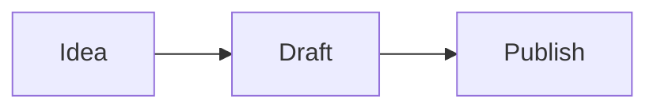
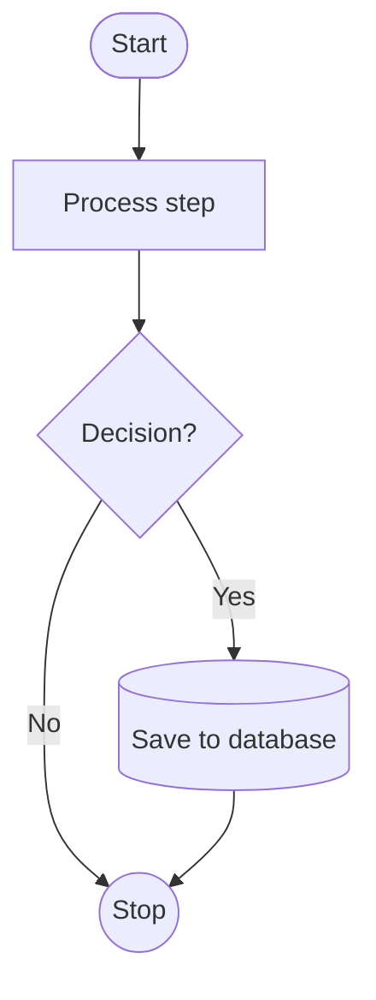
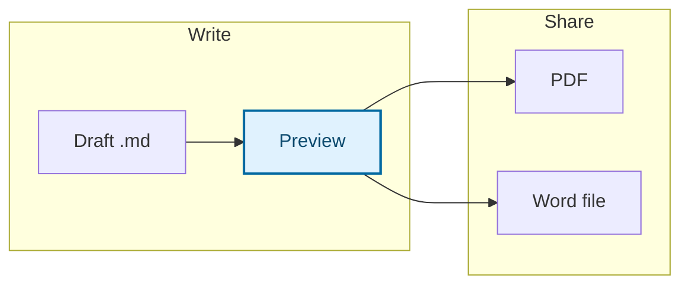
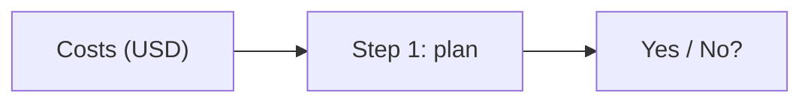
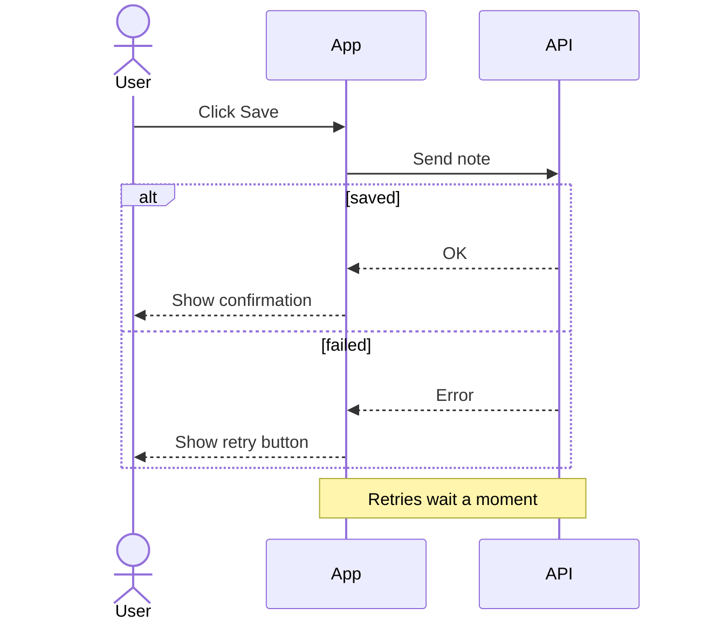
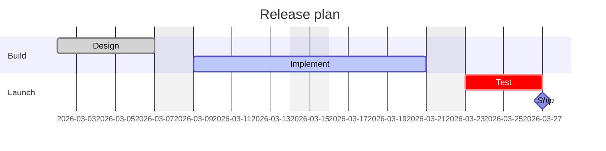
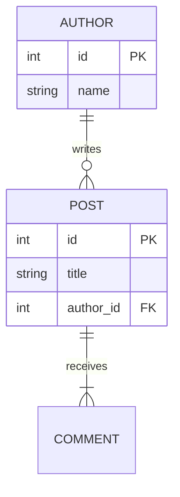

# How to draw diagrams in Markdown with Mermaid

> Draw diagrams in Markdown with Mermaid: which type to pick, copy-ready flowcharts, sequence, Gantt, class, state, ER and mind maps, plus fixes for errors.

Source: <https://quilldown.vercel.app/docs/diagrams-in-markdown>  
Updated: 2026-09-30

> [!TIP]
> **Quick answer.** Start a fenced code block with the word `mermaid` and describe the diagram inside it. The first line names the type (`flowchart TD`, `sequenceDiagram`, `gantt`, `classDiagram`, `stateDiagram-v2`, `erDiagram`, `pie` or `mindmap`), and the rest follows that type's syntax. Quilldown draws it live and matches your light or dark theme.

## How to draw a diagram in Markdown

**Start a fenced code block with the word `mermaid` and describe the diagram inside it.** Mermaid is a text-based diagramming language: you write the relationships, and the layout is worked out for you. Because the source is plain text, the diagram lives in your Markdown file, shows up cleanly in version-control diffs and is easy to edit later.

**Your first diagram**

````markdown

````

Quilldown draws Mermaid diagrams live in the preview and matches them to the light or dark theme. The toolbar has buttons for inserting diagrams, which is a quick way to get a working starting point. GitHub also renders `mermaid` blocks in Markdown files, so the same source works in a repository, for example in a [README](/docs/readme-template).

The first word inside the block declares the diagram type, and everything after it follows that type's own syntax. Get that first line right and most of the rest follows.

## When a diagram beats prose

A diagram earns its place when the reader would otherwise have to build the picture in their head.

- **Branching steps.** A process with decisions and loops is clearer as a flowchart than as nested bullets.
- **Conversations between parts.** Who calls whom, in what order, is the whole point of a sequence diagram.
- **Time and dependencies.** A schedule with tasks that wait on each other is a Gantt chart.
- **Structure.** Types, states and data relationships each have a diagram made for them.

Skip the diagram when a numbered list says the same thing, when you need exact figures (use a [table](/docs/markdown-table-generator)), or when the picture would need more than about a dozen boxes. Split big diagrams into two smaller ones rather than shrinking one.

## Which diagram type should you use?

| You want to show | Use | First line |
| --- | --- | --- |
| Steps, decisions, workflows | Flowchart | `flowchart TD` or `flowchart LR` |
| Messages between people or systems over time | Sequence diagram | `sequenceDiagram` |
| A schedule with durations and dependencies | Gantt chart | `gantt` |
| Types, fields, methods and inheritance | Class diagram | `classDiagram` |
| Lifecycle of one thing (draft, review, published) | State diagram | `stateDiagram-v2` |
| Tables in a database and how they relate | Entity-relationship diagram | `erDiagram` |
| Parts of a whole | Pie chart | `pie` |
| Ideas branching from one topic | Mind map | `mindmap` |

## Flowcharts

Flowcharts are the workhorse, so they get the most detail. After `flowchart`, give a direction:

| Direction | Flows | Suits |
| --- | --- | --- |
| `TD` (or `TB`) | Top to bottom | Portrait pages, long processes |
| `LR` | Left to right | Wide layouts, short pipelines |
| `BT` | Bottom to top | Hierarchies that grow upward |
| `RL` | Right to left | Rarely needed |

Each node has an id (`A`) and an optional label and shape. Arrows connect ids, and the text on an arrow goes between pipes:

`markdown

````

### Subgraphs and styling

Group related nodes with `subgraph … end`. Give a group of nodes a look with `classDef`, then attach it with `class`. Set the text color as well as the fill so the diagram stays readable in both light and dark themes.

**Subgraphs and a highlighted node**

````markdown

````

Use styling sparingly. One highlighted node to mark the path that matters says more than a rainbow, and color alone should never carry meaning that the labels don't.

## Labels and special characters

Most Mermaid errors come from characters that have a meaning in the syntax. Wrap the label in double quotes and it is safe:

**Quoting labels**

````markdown

````

Three more habits save time. Start a comment line with `%%`; it never appears in the drawing. Never use the lowercase word `end` as a label or id in a flowchart, because it closes a subgraph; write `End` or quote it. And keep ids short and labels descriptive, so arrows stay readable in the source.

## Sequence diagrams

Sequence diagrams draw participants as columns and messages as arrows going down the page in time order. Declare participants first to control their order, and use `as` to give one a friendlier name.

`markdown

````

## Gantt charts

A Gantt chart needs a `dateFormat`, one or more `section` lines and tasks in the form `Name :status, id, start, duration`. The status (`done`, `active`, `crit`, `milestone`) is optional. A start of `after a1` chains a task to another by id, which keeps the schedule correct when a date moves.

`markdown

````

## Class, state and entity-relationship diagrams

**Class diagrams** list a class's members inside braces, with `+` for public and `-` for private. `<|--` means inherits from, `-->` is an association and `"1"` or `"*"` next to a class shows how many.

diagram state
```

**Entity-relationship diagrams** show how data relates. The symbols around the line give how many of each side: `||` exactly one, `o|` zero or one, `|{` one or more, `o{` zero or more. Add attributes in braces with a type, a name and an optional `PK` or `FK`.

`markdown

````

## Pie charts and mind maps

A **pie chart** takes a title and quoted labels with positive numbers. Add `showData` after `pie` to print the values in the legend. Mermaid works out the percentages, so the numbers do not need to add up to 100.

diagram mindmap
```

## Keeping diagrams readable

- **Aim for about a dozen nodes.** Past that, split the diagram or move detail into text.
- **Keep labels to a few words.** A long label makes one box huge and distorts the whole layout.
- **Choose the direction for the page.** `LR` suits wide layouts; `TD` suits portrait pages and PDFs.
- **Name the arrows that matter.** Label decision branches (`Yes`, `No`) and leave the obvious ones bare.
- **Describe the diagram in the sentence above it.** It helps readers who skim, use screen readers or can't see the image.
- **Use consistent wording.** If one step says "Send" and the next says "Dispatch" for the same action, readers will look for a difference.

## Five common jobs, fastest route for each

- **Explain a process or workflow in a README or doc.** Use a flowchart. Choose `TD` for a portrait page and `LR` for a wide one, label the decision branches (Yes, No) and leave the obvious arrows bare. GitHub renders the same block, so it works in your repository unchanged. See the [README guide](/docs/readme-template).
- **Show how systems talk to each other.** Use a sequence diagram. Declare the participants first to control their order, use dashed arrows for replies, and wrap a failure path in an `alt` block.
- **Add a schedule to a proposal you'll send as a PDF.** Use a Gantt chart with `after` links so the schedule stays correct when one date moves, and set `excludes weekends` for working-day plans. Export to PDF and check the diagram in the print preview. See [Markdown to PDF](/docs/markdown-to-pdf).
- **Document a database or a design.** Use an ER diagram for tables and their relationships, or a class diagram for types and inheritance. Add attributes with `PK` and `FK` markers where they help.
- **Turn Mermaid code from an AI chat into a working diagram.** Paste the code into a fence tagged `mermaid`, and check that the first line names a valid type. If you see a Diagram error, compare the line the message names with the examples on this page. The usual culprits are parentheses in an unquoted label and the lowercase word `end`.

## Common errors and how to fix them

When Mermaid can't parse a diagram, the preview shows an error message that usually names the offending line. Match it against the table.

| Symptom | Likely cause | Fix |
| --- | --- | --- |
| Code is shown as text, no drawing | The fence isn't tagged `mermaid`, or it is never closed | Write ```` ```mermaid ```` and close with three backticks |
| A "Diagram error" box with a parse message | A typo in the type keyword, such as `flowchar`, or a missing arrow | Check the first line against the table above, then the line the message names |
| Error on a label with brackets | `A[Costs (USD)]` has parentheses inside brackets | Quote it: `A["Costs (USD)"]` |
| A subgraph or the whole chart breaks | A node or label named `end` in lowercase | Use `End` or `"end"` |
| Mind map nests wrongly | Inconsistent indentation | Indent every level with the same number of spaces |
| Gantt bars land in the wrong place | A date that doesn't match `dateFormat`, or an `after` that names an id that doesn't exist | Match dates to the format and check the ids |
| Pie chart fails | A label without quotes, or a non-numeric value | Write `"Label" : 40` |
| Boxes are huge or text overflows | Very long labels | Shorten the label and put the detail in the prose |

> [!TIP]
> Fix errors from the top. One early mistake, such as a missing keyword, can make every later line look wrong.

## Diagrams in exports and other tools

- **PDF.** Choose Export, then PDF. The browser's print dialog opens and you pick Save as PDF; diagrams appear as they do in the preview. The [Markdown to PDF guide](/docs/markdown-to-pdf) has page-setup tips.
- **Word (.docx).** Diagrams are exported as images, so they look right but can't be edited in Word. Keep the Mermaid source in your `.md` file. See [Markdown to Word](/docs/markdown-to-word).
- **GitHub.** `mermaid` blocks render in Markdown files, issues and pull requests, so the same source works there.
- **Other platforms.** Support varies, so check before you publish. When it is missing, the block appears as ordinary code.

For everything else you can put in a document, see the [Markdown cheat sheet](/docs/markdown-cheat-sheet). To add formulas beside your diagrams, read [how to write math in Markdown](/docs/math-in-markdown).

## Other ways to add a diagram to a document

| Where | Good for | Trade-offs |
| --- | --- | --- |
| **Quilldown with Mermaid** | Diagrams that live in your text, with a live preview that works offline | Layout is automatic, so you can't drag boxes around |
| **GitHub and other platforms that render Mermaid** | Diagrams inside READMEs, issues and pull requests | Support varies by platform, and an unsupported one shows the block as plain code |
| **Drag-and-drop diagram apps** | Polished, hand-placed visuals | The diagram lives outside your text, so version control and editing take more effort |
| **A screenshot or picture** | Quick one-off sharing | Can't be edited, searched or diffed |

## What diagrams in Quilldown can't do

<div class="fx-limits dia-limits"><p class="fx-limits-intro">Knowing the limits saves time.</p><ul><li><b>Layout is automatic.</b> Mermaid works out where boxes go, so you can't position them by hand.</li><li><b>Colors follow your theme.</b> You can highlight nodes with <code>classDef</code>, but keep the labels carrying the meaning.</li><li><b>Word exports contain diagrams as images,</b> so they can't be edited in Word. Keep the Mermaid source in your Markdown.</li><li><b>Other platforms may not render Mermaid at all,</b> in which case the block appears as ordinary code.</li><li><b>Very large diagrams get cramped.</b> Aim for about a dozen nodes and split anything bigger.</li><li><b>A syntax mistake anywhere can break the whole diagram,</b> and later lines may look wrong because of one early error.</li></ul></div>

## Frequently asked questions

### How do I add a diagram to Markdown?

Add a fenced code block whose language is `mermaid` and write the diagram description inside it, starting with the diagram type such as `flowchart TD`. An editor that supports Mermaid, like Quilldown, draws it live in the preview.

### Which diagram type should I choose?

Use a flowchart for steps and decisions, a sequence diagram for messages between systems over time, a Gantt chart for schedules, a class or ER diagram for structure, a state diagram for a lifecycle, a pie chart for parts of a whole and a mind map for brainstorming. The chooser table on this page lists the first line for each type.

### Can I export Markdown diagrams to PDF or Word?

Yes. In a [PDF export](/docs/markdown-to-pdf) the diagrams appear as they do in the preview, and a [Word export](/docs/markdown-to-word) contains them as images. The images can't be edited in Word, so keep the Mermaid source in your Markdown file.

### Do Mermaid diagrams work on GitHub?

Yes. GitHub renders `mermaid` code blocks in Markdown files, issues and pull requests, so a diagram you draft in Quilldown can be pasted into a repository unchanged. Other sites vary, and a platform without Mermaid support will show the block as plain code.

### Why do I see "Diagram error" instead of my diagram?

Mermaid couldn't parse the text. Common causes are a misspelled diagram type on the first line, parentheses inside an unquoted label, the lowercase word `end` used as a label, or inconsistent indentation in a mind map. Read the line number in the message and compare that line with the examples above.

### Do diagrams work offline?

Yes. Quilldown works offline after your first visit, so diagrams keep drawing without a connection.

### How do I make a flowchart in Markdown?

Add a code fence tagged `mermaid`, start with `flowchart TD` (top to bottom) or `flowchart LR` (left to right), then connect nodes with arrows, for example `A[Start] --> B[Next step]`. Put decision labels on arrows with pipes, such as `C -->|Yes| D`.

### How do I make a Gantt chart in Markdown?

Use a `mermaid` fence that starts with `gantt`, add `dateFormat YYYY-MM-DD`, group tasks under `section` lines, and write each task as a name, a colon, an optional status, an id, a start and a duration. Start a task with `after a1` to chain it to another task by id.

### How do I make a sequence diagram in Markdown?

Start a `mermaid` fence with `sequenceDiagram`, declare your participants, then write messages as `A->>B: text`. Use `-->>` for replies, and `alt`, `loop` and `opt` blocks for branches and repetition.

### How do I add a diagram to a GitHub README?

Put the diagram in a code fence tagged `mermaid` in your README. GitHub renders it, and you can draft and preview it in Quilldown first. See the [README guide](/docs/readme-template).

### How do I paste a Mermaid diagram from an AI chat into Markdown?

Wrap the code in a fence tagged `mermaid`, make sure the first line is a valid diagram type, and check the preview. If it shows a Diagram error, quote any label that contains parentheses, avoid the lowercase word `end`, and check the indentation on mind maps.

### How do I save a diagram as an image?

Export as PNG saves the whole document as one image, so put the diagram in its own document to get only the diagram. Copy as HTML, or Export as HTML, includes the diagram as inline SVG if you need the vector version.

### Can I use parentheses, slashes or colons in a label?

Yes, if you wrap the label in double quotes, for example `A["Costs (USD)"]`. Without quotes, characters that have a meaning in Mermaid can break the diagram.

### What's the difference between a flowchart and a sequence diagram?

A flowchart shows steps and decisions in a process, without a time axis. A sequence diagram shows messages between people or systems in the order they happen, top to bottom.
