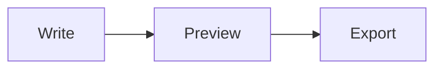

# How to use Quilldown, one button at a time

> Learn how to use the Quilldown Markdown editor with an interactive tour. Click any button in the editor copy to see what it does, with examples.

Source: <https://quilldown.vercel.app/docs/how-to-use>  
Updated: 2026-10-05

How to use Quilldown

# How to use Quilldown, one button at a time

Scroll and a pointer walks you around a copy of the editor, showing what every button does. Or skip ahead and click anything in the copy to see an explanation with an example. It is the quickest way to learn the whole tool.

Start the tour
[Or open the editor](https://quilldown.vercel.app/#editor)

## A guided tour of the editor

-

### Open a file

Start here if you already have something written. Pick one or several Markdown files, or drag them onto the page.

-

### Start something new

A blank page, a sample, or a template such as a README, résumé or meeting notes.

-

### Tabs for every document

Each document gets its own tab. Double-click a name to rename it, and drag to reorder.

-

### Add another tab

The plus opens a fresh blank document without touching the ones you already have open.

-

### Copy it the way you need

Formatted text, a clean paste for Google Docs, raw Markdown or HTML. The icon turns into a check when it works.

-

### Export to a file

PDF, Word, PNG, EPUB, HTML, Markdown or plain text. Every file is made in your browser.

-

### Share with a link

The whole document is packed into the link. Nothing is uploaded to a server.

-

### Find and replace

Search the document, match case or whole words, or use a regular expression.

-

### Jump around with the outline

A list of every heading. Click one to go straight there.

-

### Choose your layout

Editor only, split view or preview only. Pick whatever suits the moment.

-

### Scrolling in step

Scroll one pane and the other follows, matched block by block.

-

### Light or dark

Switch the theme. Quilldown remembers which one you like.

-

### Full screen

Fill the window with the editor. Press Esc to come back.

-

### Undo and redo

Take back a change, or bring it back again.

-

### Text styles

Bold, italic, underline, strikethrough, code, highlight, superscript, subscript and keyboard keys.

-

### Headings and blocks

Six heading levels, quotes, code blocks and dividers.

-

### Lists

Bullets, numbers and to-do lists. Press Enter to keep going.

-

### Links, images and tables

Add a link, drop in a picture or build a table in a grid.

-

### Math and diagrams

Equations written in LaTeX and charts written as text, drawn live as you type.

-

### Callouts and extras

Notes and warnings, collapsible sections, footnotes and emoji.

-

### This is where you write

Type or paste Markdown. Lists continue on Enter, and a pasted picture becomes an image.

-

### Resize the panes

Drag the divider to give either side more room. Double-click it to reset.

-

### The finished page

Headings, tables, equations and diagrams appear as they will in your document.

-

### Copy the source

One click puts your Markdown on the clipboard, and the icon confirms it.

-

### Copy the result

Copy formatted text, or use Copy for Docs for exact heading sizes in Google Docs and Word.

-

### Counts as you go

Words, characters and an estimated reading time.

-

### Saved for you

Every tab is stored in your browser as you type. Nothing leaves your device.

-

### That is the whole tool

Now try it for real. Open the editor and write your first line.

The full reference

## Every feature, explained

The same explanations the tour shows, in one place. Pick an area to narrow the list. On a Mac, read Ctrl as &#8984;.

### Tabs

Several documents, side by side, like browser tabs.

#### Quilldown logo

Back to the homepage.

Click the logo to leave the full-screen editor and return to the Quilldown homepage. Nothing is lost when you do. Your tabs and text stay exactly as they are, so you can step back in whenever you like.

#### Document tabs

CtrlAlt← / →

Keep several documents open at once.

Every document lives in its own tab, just like browser tabs. Click a tab to switch to it, and each one remembers its own cursor and scroll position. You can keep up to 30 open.

- Switch: click a tab, or press Ctrl Alt ← or →.
- Rename: double-click the tab name, type, then press Enter. Esc cancels.
- Reorder: drag a tab left or right.
- Close: press the ×, middle-click, or press Ctrl Alt W.

Good to know. A small dot before a name means the tab is linked to a file on your computer. It turns orange when you have unsaved changes. Undo history resets when you switch tabs, so finish a thought before you move on.

#### Close a tab

Close it, and bring it back if you slip.

Press the × on a tab to close it. You can also middle-click the tab, or press Ctrl Alt W. If the tab had writing in it, a message appears with an Undo button that restores it exactly as it was.

Close the very last tab and Quilldown gives you a fresh blank one, so you are never left with nothing to type in.

#### New tab

CtrlAltN

Start a blank document.

The + at the end of the tab strip opens a new, empty document in its own tab. If you would rather start from a ready-made layout, use the New menu next to the Open button instead.

### Open, copy and share

Getting files in, and getting your writing out.

#### Open a file

CtrlO

Bring an existing Markdown file into the editor.

Pick one or more files and each opens in its own tab. Quilldown reads .md, .markdown, .mdown, .mkd, .txt and .text files. You can also drag files from your desktop and drop them anywhere on the page.

In Chrome and Edge the tab stays linked to the file on your computer, so Ctrl S saves your changes straight back to it. In other browsers, Save downloads a fresh copy instead.

Good to know. Files are read inside your browser. Nothing is uploaded.

[Open a .md file: the full answer](https://quilldown.vercel.app/faq#open-md-file)

#### New document

A blank page, a sample, or a ready-made template.

The New menu opens a document in a fresh tab. Choose Blank document for an empty page, or Sample document for a tour of everything Markdown can do.

Under Templates you will find eight starters: README, Meeting notes, Résumé, Blog post, Email, Tables, To-do list and Notes. Each one opens in its own tab, ready to edit.

[The README template guide](https://quilldown.vercel.app/docs/readme-template)

#### Copy menu

Four ways to copy your document.

Open the menu and pick what ends up on your clipboard:

- Formatted text is the rich text you see in the preview. Paste it into an email or a document.
- Copy for Docs uses point sizes Google Docs and Word understand: H1 23, H2 17, H3 14 and body text 12. It sets no font, so pasted text takes on the font of your document.
- Markdown is the raw source.
- HTML is clean markup, ready to paste into a website or CMS.

Good to know. When the copy works, the button swaps its icon for a green check mark. If your browser blocks it, you get a red cross instead.

[Copy into Word and Google Docs](https://quilldown.vercel.app/docs/markdown-to-word)

#### Export menu

CtrlS

Turn the document into a file.

Export builds the file inside your browser. Nothing is sent anywhere.

- Save writes back to the file you opened, or downloads a .md.
- PDF opens your browser’s print dialog. Choose “Save as PDF”.
- Word (.docx) is a real Word file with real footnotes. It opens in Word, Google Docs and Pages.
- Image (.png) is the whole document as one picture.
- E-book (.epub) works in Apple Books, Kobo and Kindle apps.
- HTML file is a standalone, styled page. Markdown and Plain text download the source or the rendered words.

Good to know. Word cannot draw KaTeX or Mermaid, so equations arrive as TeX text and diagrams as pictures. If equations must look typeset, export to PDF. Very long documents are too tall for one PNG, so use PDF for those.

[Markdown to PDF](https://quilldown.vercel.app/docs/markdown-to-pdf)

#### Share as a link

A link that carries the whole document.

Share packs your document into the link itself. Nothing is uploaded, and whoever opens the link gets their own private copy in a new tab.

- Press Share and copy the link from the box.
- Tick Open in preview-only mode if the reader should see the finished page rather than the editor.
- Send the link however you like.

Good to know. Long documents make long links. Quilldown warns you above about 8,000 characters and will not make a link past 64,000. Pasted images are left out of share links, so use a web address for pictures you want to share.

#### Install as an app

Put Quilldown on your computer or phone.

This button appears when your browser is ready to install Quilldown, which usually means Chrome or Edge. Once installed, it opens in its own window, works without a connection, and appears in your system’s Open with menu for Markdown files.

Do not see the button? Look in your browser menu for “Install Quilldown”. Some browsers keep that option there instead.

### View and layout

Find, outline, split view, scroll sync, theme and full screen.

#### Find and replace

CtrlF

Search the document, and change many things at once.

Press Ctrl F to open the search bar. Matches light up behind your text and the counter tells you how many there are. Enter jumps to the next one, Shift Enter to the previous one.

Press Ctrl H, or the small arrow on the left, to add a Replace box. Replace changes the current match and All changes every one.

- Aa matches case (Alt C).
- ab matches whole words (Alt W).
- .* treats your search as a regular expression (Alt R).

#### Outline

A map of your headings.

The outline opens a sidebar listing every heading in the current document, indented by level. Click one to jump straight to it. The current section is highlighted as you scroll.

It is the quickest way to move around a long document, and a good check that your headings make sense when read on their own.

#### Editor only

Just the writing pane.

Hides the preview so the editor takes the whole width. Good for drafting when you do not need to see the result yet. Switch back any time.

#### Split view

Write on the left, see it on the right.

The default layout. Markdown on one side, the finished page on the other, updating as you type. Drag the divider between them to change the balance.

On a phone the panes stack instead, and you switch between writing and preview with the view buttons.

#### Preview only

Just the finished page.

Shows only the rendered document, as a reader would see it. The snippet toolbar fades out because there is no editor to apply it to. It is a good way to proofread, or to present your document.

#### Sync scroll

Keep both panes at the same place.

When this is on, scrolling the editor scrolls the preview to the matching spot, and the other way round. It lines up block by block, not by a rough percentage, so a long table or code block does not throw it off.

Switch it off if you want to read one pane while staying put in the other.

#### Light and dark theme

Pick the one that is easier on your eyes.

Switches the whole page between light and dark. Quilldown remembers your choice, and the first time you visit it follows your device setting.

Exports always use the clean, light style, so they look right on paper and in other apps whichever theme you write in.

#### Full screen

Esc

Give the editor the whole window.

Expands the editor to fill the browser window so there is nothing else on screen. Press Esc or the same button to come back to the page.

If you prefer Quilldown to open straight into the editor, switch on Start in editor in the header of the homepage.

### Undo and redo

Take back a change, or bring it back.

#### Undo

CtrlZ

Take back the last change.

Steps backwards through your edits, including the ones made by toolbar buttons. Press it several times to go back further.

Good to know. Each tab starts a fresh undo history when you switch to it.

#### Redo

CtrlY

Bring back what you just undid.

If you went back one step too far, Redo moves forward again. Ctrl Shift Z works too.

### Text styles

Bold, italic, code and the small inline touches.

#### Bold

CtrlB

Make important words stand out.

Select some text and press Bold to wrap it in double asterisks. With nothing selected, Quilldown inserts a placeholder you can type over. Press it again on bold text to take the bold off.

Bold

```
This is **very important** news.
```

This is very important news.

#### Italic

CtrlI

Add emphasis, a title or a foreign word.

Wraps the selection in underscores. Use it for gentle emphasis, book titles or terms you are introducing.

Italic

```
She read _The Left Hand of Darkness_ twice.
```

She read The Left Hand of Darkness twice.

#### Underline

CtrlU

Underline a word or phrase.

Markdown has no underline of its own, so Quilldown uses a small HTML tag, <u>. It displays correctly in the preview and in your exports.

Underline

```
Please <u>read this first</u>.
```

Please read this first.

Good to know. Underlined text looks like a link to many readers. Use it sparingly.

#### Strikethrough

CtrlShiftX

Cross something out.

Wraps the selection in double tildes. Useful for edits, finished items and prices that changed.

Strikethrough

```
The meeting is ~~Tuesday~~ Thursday.
```

The meeting is Tuesday Thursday.

#### Inline code

CtrlE

Show a command, file name or snippet.

Wraps the selection in backticks and sets it in a monospace font. Use it for anything the reader might type or copy exactly.

Inline code

```
Run `npm install` to get started.
```

Run npm install to get started.

#### Highlight

Mark a phrase like a highlighter pen.

Wraps the selection in <mark>, which shows as a soft yellow background. It is handy for study notes and review comments.

Highlight

```
Remember the <mark>deadline is Friday</mark>.
```

Remember the deadline is Friday.

x²

#### Superscript

Raise a character above the line.

Uses <sup>. Good for powers, ordinals and footnote-style marks.

Superscript

```
The area is 25 m<sup>2</sup>, on the 3<sup>rd</sup> floor.
```

The area is 25 m2, on the 3rd floor.

x₂

#### Subscript

Lower a character below the line.

Uses <sub>. Good for chemical formulas and indices.

Subscript

```
Water is H<sub>2</sub>O.
```

Water is H2O.

#### Keyboard key

Show a key as a little keycap.

Wraps the selection in <kbd> so a key looks like a key. Perfect for instructions and shortcut lists.

Keyboard key

```
Press <kbd>Ctrl</kbd> + <kbd>S</kbd> to save.
```

Press Ctrl + S to save.

### Headings and blocks

Headings, quotes, code blocks and dividers.

#### Headings

Six levels, plus normal text.

Open the menu and choose Heading 1 to 6. The number of # signs at the start of the line sets the level. Picking a different level on a heading changes it rather than stacking symbols, and Normal text removes the heading.

Headings also feed the Outline, so give every section a clear one.

Headings

```
# Heading 1

## Heading 2

### Heading 3
```

Heading 1

Heading 2

Heading 3

[The Markdown cheat sheet](https://quilldown.vercel.app/docs/markdown-cheat-sheet)

#### Quote

Set a passage apart.

Puts a > at the start of each selected line. Press it again to remove the quote.

Quote

```
> Simplicity is the ultimate sophistication.
>
> A note on design
```

Simplicity is the ultimate sophistication.

A note on design

#### Code block

A fenced block for several lines of code.

Wraps the selection in three backticks. Type a language name straight after the opening fence, for example js or python, and the preview colors the code. Every block in the preview gets a Copy button.

Code block

```
```js
const total = items.length;
console.log(total);
```
```

```
const total = items.length;
console.log(total);
```

#### Horizontal rule

A divider between sections.

Inserts --- on its own line, which draws a thin line across the page. It separates topics without needing a heading.

Horizontal rule

```
Above the line

---

Below the line
```

Above the line

Below the line

### Lists

Bullets, numbers and to-dos.

#### Bullet list

Unordered items.

Adds a - to every selected line. Press Enter at the end of an item to start the next one, and Enter on an empty item to finish the list. Tab indents an item into a sub-list, Shift Tab brings it back.

Bullet list

```
- Fruit
- Apples
- Pears
- Bread
- Milk
```

- Fruit

- Apples

- Pears

- Bread

- Milk

#### Numbered list

Items in order.

Numbers the selected lines. As you press Enter, the next number appears for you. If you reorder items later, Markdown renumbers them in the preview.

Numbered list

```
1. Preheat the oven
2. Mix the batter
3. Bake for 30 minutes
```

- Preheat the oven

- Mix the batter

- Bake for 30 minutes

#### Task list

A to-do list with checkboxes.

Starts each line with - [ ]. The preview shows a checkbox. To mark something done, type an x between the brackets, like [x].

Task list

```
- [ ] Write the draft
- [ ] Check the numbers
- [ ] Send it off
```

-   Write the draft

-   Check the numbers

-   Send it off

### Links, images and tables

Things you point to, show or tabulate.

#### Link

CtrlK

Point to a web page.

Select the words you want to turn into a link and press Ctrl K. Quilldown wraps them as [text](https://) and puts your cursor where the address goes.

Link

```
Read the [Markdown cheat sheet](https://quilldown.vercel.app/docs/markdown-cheat-sheet).
```

Read the [Markdown cheat sheet](https://quilldown.vercel.app/docs/markdown-cheat-sheet).

Good to know. There is a faster way. Select some text, then paste a web address over it. Quilldown makes the link for you.

#### Image

Add a picture three ways.

Open the menu to upload from your computer, or add an image from a web address. You can also just paste or drop a picture straight into the editor, for example a screenshot.

Pictures you add are stored inside the document in your browser, and they are included when you export to Word, EPUB, PNG or a Markdown file with images.

Image from a web address

```

```

🖼 A short description

Good to know. Always fill in the description in the square brackets. Screen readers read it out, and it shows if the picture cannot load.

#### Table

Build a table in a grid, not with pipes.

Opens a visual editor. Type into the cells and use Tab and Enter to move around. You can paste rows straight from a spreadsheet, add rows and columns, and set each column to left, center or right alignment. Press Insert table and tidy Markdown lands in your document.

If your cursor is already inside a table, the same button opens that table for editing.

Table

```
| Plan | Price |
| :--- | ---: |
| Editor | Free |
| Exports | Free |
```

Plan |
Price |

Editor |
Free |

Exports |
Free |

[The Markdown table guide](https://quilldown.vercel.app/docs/markdown-table-generator)

### Math and diagrams

Equations and charts, written as plain text.

#### Inline math

A formula inside a sentence.

Wraps the selection in single dollar signs. Write LaTeX between them and it renders with KaTeX in the preview.

Inline math

```
The area of a circle is $\pi r^2$.
```

The area of a circle is πr2\pi r^2πr2.

[Math in Markdown](https://quilldown.vercel.app/docs/math-in-markdown)

#### Math block

A formula on its own line, centered.

Wraps the selection in double dollar signs, on separate lines. Use it for larger equations that deserve their own space.

Math block

```
$$
\sum_{i=1}^{n} i = \frac{n(n+1)}{2}
$$
```

∑i=1ni=n(n+1)2\sum_{i=1}^{n} i = \frac{n(n+1)}{2}i=1∑n​i=2n(n+1)​

ƒx

#### Formula templates

Start from a ready-made equation.

Pick a template and it drops in as a math block you can edit: Fraction, Sum, Integral, Quadratic formula or Matrix. It is the easiest way to learn the LaTeX for each.

Quadratic formula

```
$$
x = \frac{-b \pm \sqrt{b^2-4ac}}{2a}
$$
```

x=−b±b2−4ac2ax = \frac{-b \pm \sqrt{b^2-4ac}}{2a}x=2a−b±b2−4ac​​

#### Diagrams

Draw charts from plain text.

Choose a type and Quilldown inserts a starter diagram written in Mermaid. Change the words and the picture redraws in the preview. There are eight types: Flowchart, Sequence, Class, State, Entity relationship, Gantt chart, Pie chart and Mind map.

Flowchart

```

```

```
flowchart LR
A[Write] --> B[Preview] --> C[Export]
```

[Diagrams in Markdown](https://quilldown.vercel.app/docs/diagrams-in-markdown)

### Callouts and extras

Notes, collapsible sections, footnotes and emoji.

#### Callouts

Highlight a note, tip or warning.

Choose Note, Tip, Important, Warning or Caution. Each inserts a GitHub-style callout with its own color and title. Select text first and it moves inside the callout.

Callout

```
> [!TIP]
> Press Ctrl+B to make selected text bold.
```

Tip

Press Ctrl+B to make selected text bold.

#### Collapsible section

Hide detail until the reader asks for it.

Inserts a <details> block with a clickable summary. The content inside stays folded until the reader opens it. It suits FAQs and long optional notes.

Collapsible section

```
<details>
<summary>Show the answer</summary>

It is 42.

</details>
```

### Show the answer

It is 42.

#### Centered block

Center something on the page.

Wraps the selection in a centered div. Handy for a title line or a logo at the top of a README.

Centered block

```
<div align="center">

**Project name**

</div>
```

Project name

//

#### Hidden comment

A note only you can see.

Wraps the selection in an HTML comment. It stays in your Markdown but never shows in the preview or in exports. Use it for reminders to yourself.

Hidden comment

```
Visible text.

<!-- Check this figure before publishing -->
```

Visible text.

[¹]

#### Footnote

Add a reference at the bottom of the page.

Puts a numbered marker at your cursor and a matching note at the end of the document, then selects the note so you can type it straight away. Numbers are handled for you. In a Word export they become real footnotes.

Footnote

```
Markdown is easy to learn.[^1]

[^1]: John Gruber created it in 2004.
```

Markdown is easy to learn.1

- John Gruber created it in 2004. ↩

#### Emoji

Pick one, or type a shortcode.

The picker has search, categories, skin tones and a list of the ones you used recently. Click an emoji to insert it.

You can also type a colon and the first letters of a name, such as :roc, to see suggestions. Finish with a closing colon, as in :tada:, and it turns into 🎉.

Emoji shortcodes

```
Shipped :rocket: and it works :tada:
```

Shipped 🚀 and it works 🎉

[Emoji shortcodes](https://quilldown.vercel.app/docs/emoji-in-markdown)

### Editor and preview

The two panes, the divider and the copy buttons.

#### The editor

Where you write.

Type or paste Markdown here. A few small helpers keep you moving:

- Enter on a list item starts the next one.
- Tab indents a list item, or adds two spaces anywhere else.
- Paste a screenshot and it becomes an image in your document.
- Select text and paste a web address to make it a link.
- Drop a .md file anywhere on the page to open it.

Good to know. Nothing here needs saving. Every tab is stored in your browser as you type.

#### The preview

What your document will look like.

The right-hand pane draws the finished page and updates as you type. Tables, equations, task lists, callouts and diagrams all appear as they will in the final document, so you catch mistakes while you write.

Hover over a code block to reveal its own Copy button.

#### Pane divider

Drag to give one side more room.

Drag the line between the panes to change how much space each gets. Double-click it to reset to an even split. If it has keyboard focus, the left and right arrow keys nudge it. Your choice is remembered.

#### Copy Markdown

Copy the raw source.

Copies the Markdown exactly as you typed it, ready to paste into a README, a note or another editor. Images you added are included in the copy.

The icon turns into a green check mark so you know it worked.

#### Copy formatted text

Copy the preview as rich text.

Copies the document the way it looks in the preview: headings, bold, lists and tables. Paste it into an email, a chat or a word processor and the formatting comes along.

Equations and diagrams are copied as images so they survive the trip.

#### Copy for Docs

Paste cleanly into Google Docs or Word.

Copies with exact point sizes Google Docs and Word understand: H1 23 pt, H2 17 pt, H3 14 pt, body 12 pt. No font is set, so what you paste takes on the font already used in your document.

[Markdown to Word and Google Docs](https://quilldown.vercel.app/docs/markdown-to-word)

### Status bar

Counts, cursor position and saving.

#### Word count

Words, characters and reading time.

The counts update as you type. Reading time assumes about 220 words a minute, and rounds up to at least one minute for anything you have written.

#### Cursor position

Which line and column you are on.

Ln is the line number and Col is how far along the line your cursor sits. It is useful when a tool or a teammate refers to a specific line. It is hidden in preview-only view.

#### Works offline

Everything is already on your device.

This badge tells you Quilldown is ready to run without a connection. After your first visit the site caches itself, so it loads, previews and exports with no internet. It makes no third-party requests while you write.

#### Saved locally

Autosave, in your browser.

A moment after you stop typing, the active tab is saved to your browser’s local storage. It says “Saving…”, then “Saved locally”. If the browser runs out of space it tells you so.

Good to know. Clearing your browser’s site data removes saved tabs. Export anything you cannot afford to lose.

Questions about this guide

## Common questions

### Is the editor on this page the real one?

It is a faithful copy built for learning, so nothing you click here changes any document. When you are ready to try things for real, [open the editor](https://quilldown.vercel.app/#editor).

### Do I need to know Markdown before I start?

No. The toolbar writes the symbols for you, and the preview shows the result straight away. If you would like to learn the syntax behind each button, the [Markdown cheat sheet](https://quilldown.vercel.app/docs/markdown-cheat-sheet) lists all of it with examples.

### What are the most useful keyboard shortcuts?

Ctrl B for bold, Ctrl I for italic, Ctrl K for a link, Ctrl F to find, Ctrl O to open a file and Ctrl S to save. On a Mac, use &#8984; instead of Ctrl. Hover over any toolbar button in the editor to see its shortcut.

### Does Quilldown work on a phone?

Yes. The editor shows one pane at a time on a small screen, and you switch between writing and preview with the view buttons in the top bar. On this page the copy shrinks to fit, and the Learn more button under each tour step explains the part being pointed at.

### Where is my writing saved?

In your own browser, on your own device. Nothing is uploaded. Clearing your browser data removes saved tabs, so export anything you cannot afford to lose. The [privacy page](https://quilldown.vercel.app/privacy) has the details.

[See the full FAQ](https://quilldown.vercel.app/faq)

## Your turn. Write something.

Open the editor and try the buttons you just met. It takes a few seconds, and nothing leaves your browser.

[Open the editor](https://quilldown.vercel.app/#editor)
[All documentation](https://quilldown.vercel.app/docs)
