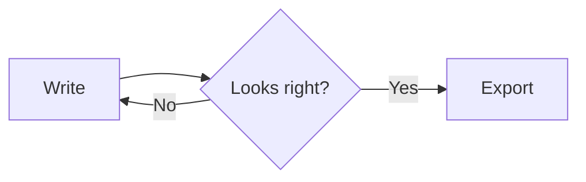

<!--
  THE FAQ CONTENT. Edit the questions and answers here, then run: node tools/build-pages.mjs
  ## Section title          (a section: it becomes a chip, a sidebar entry and a block on the page)
  ### Question? {#optional-id}   (a question; {#id} gives it a short link such as /faq#markdown-to-pdf)
  The answer, in Markdown.   (write the first sentence so it makes sense on its own)
  A fenced block starting with ```try example.md adds a "Try it in the editor" button that opens that text.
-->

## Getting started

### What is Quilldown, and who is it for?

Quilldown is a free online Markdown editor that runs in your browser. You type Markdown on one side, a live preview updates on the other, and you copy or export the result as a PDF, Word file, PNG, EPUB, HTML page or plain text. It suits developers writing READMEs, students taking notes with equations, bloggers drafting posts, and anyone who prefers plain text.

### Is Quilldown free? Do I need an account?

Yes, it's free, and there's no account, sign-up or email address. Open the page and start writing.

### How do I start writing?

Open Quilldown and type in the editor. You can also paste existing Markdown, drop in a .md file, or start from one of eight templates under New → Templates. There's nothing to install or set up.

### Which browsers does Quilldown work in?

Any current version of Chrome, Edge, Firefox or Safari. A few extras, like linking a tab to a file on your computer and the Install button, need a Chromium-based browser such as Chrome or Edge.

### Does Quilldown work on phones and tablets?

Yes. On a small screen the editor shows one pane at a time, and you switch between writing and preview with the buttons in the top bar. You can also install it as an app in browsers that offer that.

### How is Quilldown different from Word or Google Docs?

The source is plain text, so your writing is portable, easy to search and works with Git. Formatting is typed (`#` for a heading, `**` for bold) instead of clicked. You still end up with a finished document, because you can export a real Word file or paste into Google Docs.

### How is Quilldown different from other online Markdown editors?

The main differences are that it needs no account, keeps your text in your browser, works offline after your first visit, and exports to seven formats. It's a browser tool, so it doesn't manage folders of notes the way a desktop notes app can. If you need real-time collaboration or cloud sync, another tool is a better fit.

### Is Quilldown open source?

Yes. The code is public on [GitHub](https://github.com/Dhruv-Dhameliya/quilldown) under the MIT License, so you can read it, use it, change it and share it.

## Privacy and storage

### Is Quilldown private? Where is my text stored? {#private}

Your text stays in your browser. Each tab autosaves to your device's local storage, and nothing you write is uploaded to a server. There's no account, so there's no cloud copy either. The [privacy page](/privacy) explains it in full.

### Can anyone else see what I write?

No. Because your documents never reach a server, neither the maintainer nor anyone else can see or recover them. The exception is a shared link, which contains the document itself, so anyone with the link can read it.

### Does Quilldown use cookies, trackers or analytics?

No analytics, no trackers and no third-party requests while you work. It stores your drafts and a few preferences, such as your theme, in your browser on your device.

### How can I check that nothing is uploaded?

Open your browser's developer tools (F12), go to the Network tab, and type in the editor. You won't see requests carrying your text. For a stronger test, load the page once, switch off your connection and keep writing. The code is also public on [GitHub](https://github.com/Dhruv-Dhameliya/quilldown).

### What happens if I clear my browser data?

Saved tabs are removed and can't be recovered, because nothing is stored anywhere else. Export important documents with Export → Markdown (.md) or Ctrl+S first.

### Are my drafts kept in a private or incognito window?

Browsers usually discard a site's stored data when you close a private window, so treat drafts there as temporary and export anything you want to keep.

### How do I back up my documents?

Use Export → Markdown (.md) or press Ctrl+S to save a .md file. In Chrome and Edge, a tab linked to a file saves straight back to that file, which is the easiest backup.

### How do I delete everything Quilldown has stored?

Close your tabs to remove those documents, or clear this site's data in your browser settings to remove all drafts and preferences. Once cleared, they're gone.

### Is it safe to paste Markdown or HTML from an unknown source?

The preview is sanitized before it's shown, so scripts hidden in pasted content shouldn't run. As with anything you paste, use judgment with material you don't trust.

### Who owns what I write in Quilldown?

You do. Quilldown doesn't receive your writing, and the MIT License applies to the editor's code, not to your documents.

### Is Quilldown suitable for confidential or work documents?

Your text isn't sent to any server, which suits sensitive drafting. Keep in mind the limits: other people using your browser profile can open your drafts, and shared links contain the document. See the [privacy page](/privacy) for the full list.

## Markdown basics

### What is Markdown?

Markdown is a way of formatting plain text using simple symbols. A `#` makes a heading, `**` makes bold text and a dash makes a bullet. The file stays plain text, so any editor can open it. See [What is Markdown?](/docs/what-is-markdown) for a full introduction.

### What is a .md file, and how do I open one? {#open-md-file}

A .md file is a plain-text file written in Markdown. To open one in Quilldown, click Open (Ctrl+O) or drag the file onto the page. It also opens in any text editor, but there you see the raw symbols instead of the formatted page.

### Which Markdown flavor does Quilldown support?

GitHub Flavored Markdown: tables, task lists, strikethrough, autolinks and fenced code blocks with syntax highlighting. On top of that you get KaTeX math, Mermaid diagrams, footnotes, emoji shortcodes and GitHub-style callouts.

### How do I make a heading, bold text, italics, a list or a link?

Start a line with `#` and a space for a heading (`##` for a smaller one). Wrap words in `**` for bold and `*` for italics. Start a line with `-` and a space for a bullet. Write a link as `[text](https://example.com)`. The [Markdown cheat sheet](/docs/markdown-cheat-sheet) shows every symbol with a live example.

```try basics.md
# A heading

Some **bold** and *italic* words.

- A bullet
- Another bullet

[A link](https://commonmark.org)
```

### How do I make a new paragraph or a line break?

Leave a blank line between paragraphs. To break a line inside a paragraph, end the line with two spaces or a backslash.

### How do I add a code block with syntax highlighting?

Put your code between two lines of three backticks and add the language name after the first set, for example `js` or `python`. Quilldown highlights dozens of languages and adds a one-click copy button in the preview.

````try code.md
```js
const answer = 42;
console.log(answer);
```
````

### How do I make a task list?

Start each line with a dash, a space and `[ ]` for an unchecked box or `[x]` for a checked one. They render as checkboxes in the preview.

```try tasks.md
- [x] Write the draft
- [ ] Review it
- [ ] Publish
```

### How do I make a table without typing pipes?

Click Table to build one in a visual grid, set each column's alignment and insert it. You can also paste rows from Excel or Google Sheets. See [Markdown tables](/docs/markdown-table-generator).

```try table.md
| Plan   | Price |
| :----- | ----: |
| Editor | Free  |
| Export | Free  |
```

### How do I add images?

Paste a screenshot, drop a picture onto the editor, or use Image → Upload. Images are resized, stored with the document and included in every export.

### How do I add footnotes?

Write `[^1]` where the note belongs and `[^1]: your note text` on its own line. Quilldown numbers them, collects them at the bottom and links both ways. In a Word export they become real footnotes.

```try footnote.md
A claim that needs a source.[^1]

[^1]: Here is the source.
```

### How do I add callouts like Note or Warning?

Use the Callouts dropdown, or start a quote with `> [!NOTE]`, `[!TIP]`, `[!IMPORTANT]`, `[!WARNING]` or `[!CAUTION]`. They render as GitHub-style boxes.

```try callouts.md
> [!NOTE]
> Useful information that people should know.

> [!WARNING]
> Urgent information that needs attention.
```

### Can I use underline, highlight or centered text?

Yes, through the toolbar or inline HTML. Quilldown supports tags such as `u`, `mark`, `kbd`, `sub`, `sup` and `details`, plus alignment on blocks, so you can also make collapsible sections and centered blocks.

### Does Quilldown support emoji?

Yes. Use the emoji picker (search by name, choose a skin tone) or type a colon and a few letters, like `:roc`, to pick from suggestions. A finished `:tada:` becomes 🎉. See [Emoji shortcodes](/docs/emoji-in-markdown).

### Are there templates?

Yes, eight: README, meeting notes, résumé, blog post, email, tables, to-do list and notes. Each opens in its own tab under New → Templates.

## Math and diagrams

### Does Quilldown support LaTeX math?

Yes. Write inline math between single dollar signs and display math between double dollar signs. It renders with KaTeX, including fractions, sums, integrals, matrices and aligned equations. See [Math in Markdown](/docs/math-in-markdown).

```try math.md
Euler's identity, $e^{i\pi} + 1 = 0$, links five constants.

$$
x = \frac{-b \pm \sqrt{b^2 - 4ac}}{2a}
$$
```

### What kinds of diagrams can I draw?

Eight types from plain text using Mermaid: flowchart, sequence, class, state, ER, Gantt, pie and mind map. Each has a ready-made template on the toolbar. See [Diagrams in Markdown](/docs/diagrams-in-markdown).

````try diagram.md

````

### Do math and diagrams work in dark mode?

Yes, diagrams follow your light or dark theme. Exports always come out in a clean, light, print-friendly style.

### Why do equations and diagrams look different in Word?

Word has no KaTeX or Mermaid renderer, so the .docx keeps equations as their TeX source and inserts diagrams as images. If your equations need to look typeset, export to PDF, where they appear exactly as in the preview.

## Writing tools

### What keyboard shortcuts does Quilldown have?

On a Mac, use ⌘ instead of Ctrl. The tab shortcuts work in the full-screen editor.

<ul class="faq-keys"><li><span>Bold</span><span><kbd>Ctrl</kbd><kbd>B</kbd></span></li><li><span>Italic</span><span><kbd>Ctrl</kbd><kbd>I</kbd></span></li><li><span>Underline</span><span><kbd>Ctrl</kbd><kbd>U</kbd></span></li><li><span>Strikethrough</span><span><kbd>Ctrl</kbd><kbd>Shift</kbd><kbd>X</kbd></span></li><li><span>Inline code</span><span><kbd>Ctrl</kbd><kbd>E</kbd></span></li><li><span>Link</span><span><kbd>Ctrl</kbd><kbd>K</kbd></span></li><li><span>Find</span><span><kbd>Ctrl</kbd><kbd>F</kbd></span></li><li><span>Replace</span><span><kbd>Ctrl</kbd><kbd>H</kbd></span></li><li><span>Save</span><span><kbd>Ctrl</kbd><kbd>S</kbd></span></li><li><span>Open</span><span><kbd>Ctrl</kbd><kbd>O</kbd></span></li><li><span>New tab</span><span><kbd>Ctrl</kbd><kbd>Alt</kbd><kbd>N</kbd></span></li><li><span>Close tab</span><span><kbd>Ctrl</kbd><kbd>Alt</kbd><kbd>W</kbd></span></li><li><span>Next or previous tab</span><span><kbd>Ctrl</kbd><kbd>Alt</kbd><kbd>←</kbd><kbd>→</kbd></span></li><li><span>Leave full screen</span><span><kbd>Esc</kbd></span></li></ul>

### Does Enter continue a list?

Yes. Enter continues a list and ends it on an empty item, and Tab and Shift+Tab indent and outdent. Applying a formatting snippet twice removes it.

### Can I find and replace with regular expressions?

Yes. Press Ctrl+F or Ctrl+H, then turn on match case, whole word or regex. Regex replacements support `$1` groups, and Replace all is a single undo step.

### What is the outline sidebar?

A clickable list of all your headings, opened from the list icon in the top bar. The current section follows your scroll, so you can jump around long documents.

### How does the toolbar work?

It has 45+ one-click snippets grouped into text styles, structure, inserts, math, diagrams, callouts and layout. Hover any button to see its shortcut.

### Can I change the layout?

Yes. Choose editor only, split or preview only, and drag the divider to resize. Scrolling is synced block by block, so both sides stay aligned.

### Is there a dark mode?

Yes, a light and a dark theme. Exports are always light.

## Files and offline

### Can I have several documents open at once?

Yes, up to 30 tabs. Add one with +, drag to reorder, double-click to rename and middle-click to close. Closed one by accident? Press Undo in the message that appears.

### Which files can I open?

.md, .markdown, .mdown, .mkd, .txt and .text files, up to 5 MB each. Open several at once or drag them onto the page, and each lands in its own tab.

### Can I save back to the original file?

In Chrome and Edge, a tab you open stays linked to its file. A dot on the tab shows the link (orange means unsaved changes), and Ctrl+S saves straight back. In other browsers, Ctrl+S downloads a .md copy instead.

### Does Quilldown work offline? {#works-offline}

Yes. Everything ships with the site, and after your first visit a service worker caches it, so it loads and exports without a connection.

### Can I install Quilldown as an app?

Yes, in Chrome, Edge and other browsers that support it, using the Install button. Once installed, it also appears in your system's "Open with" menu for Markdown files.

### Can I move my documents to another device?

There's no cloud sync, so drafts don't travel on their own. Export a .md file and open it on the other device, or use Share to send yourself a link.

### Can I host Quilldown myself?

Quilldown is plain HTML, CSS and JavaScript with no build step, and the MIT License allows it, so you can copy the files to any static host. Offline use and the Install button need the site to be served over HTTPS. Keep the copyright notice and the licenses of the bundled libraries.

## Copying

### What can I copy?

Formatted text as it looks in the preview, Markdown, clean HTML, or a version made for Google Docs. Copy buttons sit on each pane, and Copy HTML is in the top-bar Copy menu.

### What is Copy for Docs?

A copy that pastes with point sizes Google Docs and Word understand: H1 at 23 pt, H2 at 17 pt, H3 at 14 pt and body text at 12 pt. It sets no font, so pasted text takes on the font of your document.

### How do I copy clean HTML for a website or CMS?

Use Copy → HTML from the top bar. It puts clean markup on your clipboard. See [Markdown to HTML](/docs/markdown-to-html).

### Does copied Markdown include my images?

Yes. Copying or saving Markdown embeds your images, so the text is self-contained, though it becomes longer.

## Exporting

### Which formats can I export to?

PDF, Word (.docx), PNG, EPUB, HTML, Markdown (.md) and plain text (.txt). Each is created in your browser and saved straight to your device.

| Format | Best for | One thing to know |
| --- | --- | --- |
| **PDF** | Print-ready files and equations | Made through your browser's print dialog |
| **Word (.docx)** | Editing in Word, Docs or Pages | Equations stay as TeX, diagrams become images |
| **PNG** | Quick sharing as one image | Too tall for very long documents |
| **EPUB** | Reading on an e-reader | Each top-level heading becomes a chapter |
| **HTML** | A standalone web page | Copy HTML gives clean markup instead |
| **Markdown, text** | Your plain source | No formatting in the text file |

### How do I convert Markdown to PDF? {#markdown-to-pdf}

Write or paste your Markdown, choose Export → PDF, and pick "Save as PDF" as the destination in the print dialog. It's free, private and works offline, and the text stays selectable. See [Markdown to PDF](/docs/markdown-to-pdf).

> [!TIP]
> If your document has equations, PDF is the best choice: they render exactly as they do in the preview.

### Can I set the page size, margins or page numbers in the PDF?

The print dialog controls paper size, margins and headers or footers, since the PDF is made through your browser. The [Markdown to PDF](/docs/markdown-to-pdf) guide covers page breaks and print settings.

### Why does my PDF look flat, or lose code block colors? {#pdf-looks-flat}

Turn on "Background graphics" in the print options, and the shaded code blocks and tables come back.

### How do I convert Markdown to Word?

Choose Export → Word (.docx). You get a real Word document with heading styles, lists, tables, links, code, callouts, images, diagrams and footnotes. It also opens in Google Docs and Pages. See [Markdown to Word](/docs/markdown-to-word).

### How do I convert Markdown to Google Docs? {#copy-to-google-docs}

There are two ways. Click Copy for Docs on the preview and paste into a Google Doc, or export a .docx and open it in Docs.

### How do I convert Markdown to HTML?

Use Copy → HTML for clean markup or Export → HTML for a standalone, styled web page.

### How do I make an EPUB e-book from Markdown?

Choose Export → EPUB. Each top-level heading becomes a chapter, with a table of contents, and the file works in Apple Books, Kobo and other readers.

### Can I export my document as an image?

Yes, Export → PNG gives you one picture of the whole document. Very long documents are too tall for a single PNG, so use PDF for those.

### Can I paste Markdown from an AI chat and turn it into a document?

Yes. Paste it into the editor and it renders straight away, including tables and code. Then copy it into Google Docs or export it as PDF or Word. See [Markdown to Word](/docs/markdown-to-word).

### Why do exports always look light, even in dark mode?

So they print and read well anywhere. The editor theme only affects what you see while you write.

### Does exporting upload my document?

No. Every export is generated in your browser, so nothing is sent to a converter or server.

## Sharing

### How does sharing work?

Click Share and Quilldown packs your document into the link itself. Nothing is uploaded, and whoever opens the link gets their own copy in a new tab.

### Is a shared link private?

The document isn't stored on a server, but anyone with the link can read it, and any app you paste the link into can see it. For sensitive documents, send a file instead.

### Is there a size limit for shared links?

You'll see a warning above about 8,000 characters, and links over 64,000 characters are refused. Pasted images aren't included.

### Can I share a preview-only link?

Yes. Choose "Open in preview-only mode" and the person sees the finished page instead of the editor.

## Troubleshooting

### My drafts disappeared. What happened? {#drafts-disappeared}

The usual causes are cleared browser data, a private window, or a different browser or device, since drafts live only in the browser where you wrote them. If you closed a tab, press Undo right away. Export .md backups to avoid this next time.

### Ctrl+S downloads a file instead of saving to my original file. Why? {#ctrl-s-downloads}

Saving back to a linked file works in Chrome and Edge only, and the tab must have been opened from a file. In other browsers, Ctrl+S downloads a .md copy.

### I can't find the Install button. {#install-button}

It appears only in browsers that support installing web apps, such as Chrome and Edge. If you've already installed Quilldown, you won't see it again.

### The editor warned me about storage. What should I do? {#storage-warning}

Browsers allow roughly 5 MB of local storage per site, and pasted images count toward it. If the status bar says "Not saved (storage full)", export the document, then shrink or remove large images.

### Undo stopped working after I switched tabs.

Switching tabs clears the editor's undo history for that tab. Finish an edit before you switch.

### My table or diagram doesn't render.

Check the syntax: tables need a header row with dashes under it, and diagrams need a code block starting with `mermaid`. The Table button and the diagram templates give you a correct starting point.

### My shared link won't open or is too long.

Very long documents make very long links, and above 64,000 characters the link is refused. Export the document as a file instead.

### How do I report a bug?

Open an issue on [GitHub](https://github.com/Dhruv-Dhameliya/quilldown/issues) with your browser and, if you can, a small sample of the Markdown involved. Share only text you're comfortable making public.

## The project

### Who makes Quilldown?

Quilldown is built and maintained by one developer. See the [About](/about) page.

### Can I use Quilldown for work or commercially?

Yes. The editor is free to use for any purpose, and the code is released under the MIT License.

### How can I suggest a feature or a new FAQ?

Open an issue on [GitHub](https://github.com/Dhruv-Dhameliya/quilldown/issues). Good FAQ suggestions come from real questions, so tell us what you were trying to do.
