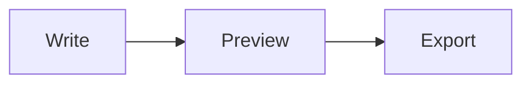

## Syntax at a glance

Everything on this page in one table. The sections below explain each row with an example and the edge cases that cause most "why doesn't this work?" moments.

| Element | Markdown syntax |
| --- | --- |
| Heading | `# H1`  `## H2`  `### H3` … up to `######` |
| Bold | `**bold text**` |
| Italic | `*italic text*` or `_italic text_` |
| Bold and italic | `***both***` |
| Strikethrough | `~~struck~~` |
| Blockquote | `> quoted text` |
| Ordered list | `1. First` `2. Second` |
| Unordered list | `- Item` (or `*` or `+`) |
| Task list | `- [x] Done` `- [ ] To do` |
| Inline code | `` `code` `` |
| Code block | ` ``` ` on its own line, before and after |
| Horizontal rule | `---` |
| Link | `[title](https://example.com)` |
| Image | `` |
| Table | `\| A \| B \|` with a `\| --- \| --- \|` row |
| Footnote | `text[^1]` and `[^1]: note` |
| Hard line break | two trailing spaces, or `\` at the end of the line |
| Escape a symbol | `\*` `\#` `\_` |
| Comment | `<!-- hidden -->` |
| Math | `$x^2$` inline, `$$ … $$` block |
| Diagram | a fenced block tagged `mermaid` |
| Callout | `> [!NOTE]` then the text on the next line |
| Emoji | `:tada:` |

## Headings

Start a line with one to six `#` characters followed by a space. One `#` is the top-level title; more `#` mean smaller headings. There is also an older underline style, which only covers the top two levels.

````example title="Heading levels"
# Heading 1
## Heading 2
### Heading 3
#### Heading 4
##### Heading 5
###### Heading 6
````

````example title="Underline style (levels 1 and 2 only)"
Title with equals signs
=======================

Subtitle with hyphens
---------------------
````

> [!TIP]
> Use one `#` heading per document as the title, then `##` for sections, and do not skip levels. It keeps your outline clean and your table of contents useful. Put a blank line above and below every heading.

## Paragraphs and line breaks

Separate paragraphs with a blank line. A single new line inside a paragraph is treated as a space. To force a line break, end the line with **two spaces** or a backslash.

````example title="Paragraphs and line breaks"
This is the first paragraph.

This is the second paragraph.

Roses are red,\
violets are blue.
````

> [!WARNING]
> Trailing spaces are invisible and many editors strip them on save, which silently removes your line break. The backslash is easier to see and survives. A few places, such as GitHub issue comments, turn every new line into a break, but do not rely on that in files.

## Bold, italic and strikethrough

````example title="Emphasis"
**Bold** with asterisks, __bold__ with underscores.

*Italic* with asterisks, _italic_ with underscores.

***Bold and italic*** together.

~~Strikethrough~~ for deleted text.

Mid-word emphasis: un**believ**able.
Underscores inside words stay literal: snake_case_name.
````

Asterisks work everywhere, including inside a word. Underscores are ignored inside words, which is why identifiers such as `snake_case_name` do not turn italic. The opening symbol must touch the text: `** bold **` with spaces inside does not work.

## Blockquotes

Start each line with `>`. Add more `>` to nest quotes, and use other Markdown inside them.

````example title="Blockquote"
> Markdown is intended to be as easy-to-read and easy-to-write as is feasible.
>
> — John Gruber
>
> > Quotes can be nested.
````

## Lists

### Unordered lists

Use `-`, `*` or `+`. Nest an item by indenting it under the text of its parent. Two spaces work for `-` bullets.

````example title="Bullet list with nesting"
- Fruit
  - Apples
  - Pears
- Vegetables
- Bread
````

Pick one marker per list. In CommonMark, switching from `-` to `*` starts a new, separate list.

### Ordered lists

Only the first number matters. The list counts up from it, so you can start at any number, and you never have to renumber after inserting an item.

````example title="Numbered list"
1. Mix the ingredients
2. Bake for 20 minutes
   1. Check after 15
   2. Rotate the tray
3. Let it cool
````

````example title="Starting at 5, ignoring later numbers"
5. Starts at five
1. Rendered as six
1. Rendered as seven
````

The rule for nesting is to line the child up with the first character of the parent's text. After `1. ` that is three spaces, after `- ` it is two. Nesting a bullet under a numbered item with only two spaces makes it a separate list.

### Paragraphs and code inside list items

Indent the extra content to the same column as the item's text and separate it with blank lines.

`````example title="Multiple blocks in one list item"
1. Install the dependencies:

   ```bash
   npm install
   ```

2. Start the app.

   Open the address it prints.
`````

### Task lists

Task lists come from GitHub Flavored Markdown. The box is `[ ]` with a space inside, or `[x]`, and it needs a space after the closing bracket.

````example title="Task list"
- [x] Write the outline
- [x] Draft the introduction
- [ ] Add examples
- [ ] Proofread
````

## Code

Wrap short code in single backticks. For a block, put three backticks on their own lines and add the language after the opening fence for syntax highlighting. Tildes (`~~~`) work as a fence too, and so does indenting every line by four spaces, though fences are clearer.

````example title="Inline code and a fenced block"
Run `npm install` to get started.

```js
function greet(name) {
  return `Hello, ${name}!`;
}
```
````

To show backticks *inside* inline code, wrap the code in double backticks with a space on each side. To show a fenced block *inside* a fenced block, make the outer fence longer, four backticks against three.

``````example title="Backticks inside code"
`` `literal backticks` ``

`````
```
a fence shown as text
```
`````
``````

> [!NOTE]
> The closing fence must be at least as long as the opening one. If a code block swallows the rest of your document, a missing or shorter closing fence is almost always the reason.

## Links

````example title="Links"
[Inline link](https://commonmark.org "Optional title")

[Reference-style link][spec]

Bare address: <https://commonmark.org>

[Jump to a heading](#headings)

[File name with spaces](<my notes.md>)

[spec]: https://spec.commonmark.org/
````

Reference-style links keep long URLs out of your sentences, and the definition can sit anywhere in the file. Heading links (`#headings`) use an anchor the renderer generates from the heading text. The usual rule is lowercase with hyphens instead of spaces and most punctuation removed, but the exact result depends on the tool. If an address contains spaces, wrap it in `<...>` or write `%20`. GitHub Flavored Markdown also turns bare `https://` addresses into links automatically, and `<address>` is the explicit form that works everywhere.

## Images

An image is a link with a leading `!`. The text in brackets is the *alt text*, which screen readers read aloud and search engines index, so always write something meaningful.

````example title="Image syntax"


Make an image clickable by wrapping it in a link:

[](https://example.com)
````

Markdown has no syntax for image size or alignment. Where HTML is allowed, an `` tag is the usual workaround. In Quilldown you can also paste, drop or upload an image straight into the editor, and it is stored with the document. See the [feature overview](/#features).

## Horizontal rules

Three or more hyphens, asterisks or underscores on their own line make a divider.

````example title="Horizontal rule"
Above the line

---

Below the line
````

Leave a blank line above `---`. Directly under a line of text it turns that text into a level-2 heading instead of drawing a line.

## Tables

Separate columns with pipes and add a row of hyphens under the header. Colons in that row set alignment: left, centered or right. Tables come from GitHub Flavored Markdown, and there is a full walkthrough in the [Markdown table guide](/guides/markdown-table-generator).

````example title="Table with alignment"
| Item     | Qty |  Price |
| :------- | :-: | -----: |
| Notebook |  2  |   4.50 |
| Pen      | 10  |   1.20 |
````

A few rules keep tables from breaking:

- The header row and the separator row must have the same number of columns, or the table is not recognised at all.
- Cells hold inline Markdown only: bold, links, code, images. Lists and paragraphs do not work inside a cell. Use `<br>` to force a line break within one.
- To put a literal pipe in a cell, escape it: `\|`.
- Aligning the pipes in your source is optional and only makes the source easier to read.

````example title="Formatting and line breaks inside cells"
| Command | What it does |
| --- | --- |
| `git status` | Shows **changed** files |
| `a \| b` | A pipe inside code |
| Two lines | First line<br>Second line |
````

## Footnotes

Add a marker in the text and define the note anywhere in the document. Footnotes are numbered automatically and collected at the bottom. They are an extension, not part of the CommonMark or GFM specifications, so check that your target supports them.

````example title="Footnotes"
Markdown was released in 2004.[^1] It is now everywhere.[^2]

[^1]: Created by John Gruber, with contributions from Aaron Swartz.
[^2]: From READMEs to documentation sites and note apps.
````

## Math

Wrap LaTeX in single dollar signs for inline math and double for a block. Learn more in [math in Markdown](/guides/latex-math-in-markdown).

````example title="Inline and block math"
The area of a circle is $A = \pi r^2$.

$$
\int_{-\infty}^{\infty} e^{-x^2}\,dx = \sqrt{\pi}
$$
````

In Quilldown, inline math needs no space just inside the dollar signs: `$x^2$` is math, `$ x^2 $` is not. If a paragraph mixes prices and math, escape the price as `\$5`.

## Diagrams

Put Mermaid code in a fenced block tagged `mermaid` and supporting editors draw it as a diagram. Quilldown renders it live. See [diagrams in Markdown](/guides/mermaid-diagrams-in-markdown) for every diagram type.

````example title="Mermaid flowchart source"

````

## Callouts (alerts)

Start a blockquote with `[!NOTE]`, `[!TIP]`, `[!IMPORTANT]`, `[!WARNING]` or `[!CAUTION]` to get a highlighted box. The marker goes alone on the first line, and the text follows on the next.

````example title="Callouts"
> [!NOTE]
> Useful information, even when skimming.

> [!WARNING]
> Urgent info that needs attention.
````

A tool that does not understand callouts shows them as an ordinary blockquote that begins with the literal text `[!NOTE]`. The content is still readable, which makes them a safe choice.

## Emoji

Type an emoji shortcode between colons. In Quilldown, typing a colon and the first letters, such as `:roc`, opens an autocomplete list. See the full [emoji shortcode list](/guides/markdown-emoji-shortcodes).

````example title="Emoji shortcodes"
Ship it :rocket: and celebrate :tada:
````

## HTML inside Markdown

When Markdown has no syntax for what you need, you can mix in HTML. Many platforms sanitize it, so tags such as `<script>` and inline styles are often removed.

````example title="Useful HTML tags"
Press <kbd>Ctrl</kbd> + <kbd>S</kbd> to save.

H<sub>2</sub>O and E = mc<sup>2</sup>, with <mark>highlighted</mark> and <u>underlined</u> text.

<details>
<summary>Click to expand</summary>

Hidden content, with **Markdown** still working inside.

</details>
````

Leave a blank line after the `</summary>` line (as above) if you want Markdown inside a `<details>` block to render.

## Escaping and comments

Put a backslash before a symbol to show it literally. Comments are invisible in the rendered result but still visible to anyone who reads the source, so keep secrets out of them.

````example title="Escapes and comments"
\*Not italic\* and \# not a heading.

<!-- This comment does not appear in the preview. -->

Visible text.
````

Symbols worth escaping when you mean them literally:

| Character | When it causes trouble |
| --- | --- |
| `*` and `_` | Wrapped around text, they become emphasis |
| `#` | At the start of a line, it becomes a heading |
| `-`, `+` and `1.` | At the start of a line, they become list items |
| `>` | At the start of a line, it becomes a quote |
| `` ` `` | Pairs up into inline code |
| `[` and `]` | With parentheses after them, they form a link |
| `\|` | Inside a table row, it splits the cell |
| `$` | Around text with no spaces, it can form math |

## What works where

The core syntax works everywhere. The rest depends on the dialect, so check this before you publish somewhere new.

| Feature | Core CommonMark | GitHub Flavored Markdown | Quilldown |
| --- | --- | --- | --- |
| Headings, emphasis, lists, links, images, code, quotes | Yes | Yes | Yes |
| Tables | No | Yes | Yes |
| Task lists | No | Yes | Yes |
| Strikethrough | No | Yes | Yes |
| Footnotes | No | Not in the spec | Yes |
| Math (`$…$`) | No | Not in the spec | Yes |
| Mermaid diagrams | No | Not in the spec | Yes |
| Callouts (`> [!NOTE]`) | No | Not in the spec | Yes |
| Emoji shortcodes | No | Not in the spec | Yes |

"Not in the spec" means the written specification does not define it. Individual platforms may still support it, so test in the place you are publishing. For the background on these dialects, read [what Markdown is](/guides/what-is-markdown).

## Common problems and fixes

| Problem | Fix |
| --- | --- |
| Heading shows `#` characters | Add a space after the `#` |
| List renders as one paragraph | Add a blank line before the list |
| Line break is ignored | End the line with two spaces or a backslash |
| Table does not render | Make sure the `---` separator row is present and has the same number of columns as the header |
| A pipe splits a table cell | Escape it with a backslash: `\|` |
| A `*` or `_` makes text italic by accident | Escape it with a backslash: `\*` |
| Nested list does not indent | Line the child up with the first character of the parent's text: two spaces after `- `, three after `1. ` |
| A code block never ends | The closing fence is missing or shorter than the opening one |
| Text above `---` became a big heading | Leave a blank line above the rule |
| Markdown inside an HTML block is not rendered | Leave a blank line after the opening tag |
| A price like `$5` turns into math | Escape the dollar sign: `\$5` |
| Footnote appears as plain text | Check that the marker and the `[^1]:` definition use the same label |

## Write faster in Quilldown

The toolbar inserts the right syntax with one click, and the shortcuts work in the editor: Ctrl+B for bold, Ctrl+I for italic, Ctrl+E for inline code and Ctrl+K for a link. Ctrl+F opens find and Ctrl+H opens replace. For tables, the visual Table editor lets you build, edit or convert a table and paste one from Excel or Google Sheets, so you never align pipes by hand.

## Frequently asked questions

### What is the difference between `*` and `_` for italics?

They are interchangeable for whole words. Use asterisks when you want to italicise *part* of a word, because underscores inside words are usually ignored, which also keeps names like `snake_case_name` intact.

### How do I make text a different color in Markdown?

Markdown has no color syntax. If your tool allows raw HTML you can use a styled tag, but many platforms strip inline styles. Formatting like color is deliberately outside Markdown's scope, and that is what keeps the files portable.

### How do I add a page break or center text?

Neither has Markdown syntax. Many renderers, including GitHub, honor `<div align="center">` for centering, but check how your target treats HTML. For page breaks, use your export target's settings, such as the print dialog when you [convert Markdown to PDF](/guides/markdown-to-pdf).

### How do I show backticks or a code fence inside code?

For inline code, wrap it in double backticks and put a space inside each end. For a fenced block that contains another fence, use four backticks on the outside and three on the inside. The outer fence just has to be longer than any fence inside it.

### Does every Markdown editor support tables, task lists and footnotes?

Tables, task lists and strikethrough come from GitHub Flavored Markdown and are widely supported. Footnotes, math, diagrams and callouts are extensions, so support varies. Quilldown supports all of them.

### How do I create a line break without starting a new paragraph?

End the line with two spaces or with a backslash, or write `<br>`. The backslash is the most reliable because editors often strip trailing spaces.

### Where can I practise?

Open the [Quilldown editor](/), press **New → Sample document** for a guided tour, or use the **Open in editor** button on any example above.
