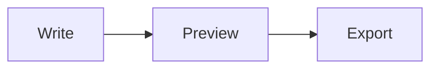

## Syntax at a glance

| Element | Markdown syntax |
| --- | --- |
| Heading | `# H1`  `## H2`  `### H3` … up to `######` |
| Bold | `**bold text**` |
| Italic | `*italic text*` or `_italic text_` |
| Bold and italic | `***both***` |
| Strikethrough | `~~struck~~` |
| Blockquote | `> quoted text` |
| Ordered list | `1. First` `2. Second` |
| Unordered list | `- Item` (or `*` or `+`) |
| Task list | `- [x] Done` `- [ ] To do` |
| Inline code | `` `code` `` |
| Code block | ` ``` ` on its own line, before and after |
| Horizontal rule | `---` |
| Link | `[title](https://example.com)` |
| Image | `` |
| Table | `\| A \| B \|` with a `\| --- \| --- \|` row |
| Footnote | `text[^1]` and `[^1]: note` |
| Math | `$x^2$` inline, `$$ … $$` block |
| Emoji | `:tada:` |

## Headings

Start a line with one to six `#` characters followed by a space. One `#` is the top-level title; more `#` mean smaller headings.

````example title="Heading levels"
# Heading 1
## Heading 2
### Heading 3
#### Heading 4
##### Heading 5
###### Heading 6
````

> [!TIP]
> Use one `#` heading per document as the title, then `##` for sections. It keeps your outline clean, your table of contents useful and your page search-friendly.

## Paragraphs and line breaks

Separate paragraphs with a blank line. A single new line is treated as a space. To force a line break inside a paragraph, end the line with **two spaces** or a backslash.

````example title="Paragraphs and line breaks"
This is the first paragraph.

This is the second paragraph.

Roses are red,\
violets are blue.
````

## Bold, italic and strikethrough

````example title="Emphasis"
**Bold** with asterisks, __bold__ with underscores.

*Italic* with asterisks, _italic_ with underscores.

***Bold and italic*** together.

~~Strikethrough~~ for deleted text.
````

## Blockquotes

Start each line with `>`. Add more `>` to nest quotes, and use other Markdown inside them.

````example title="Blockquote"
> Markdown is intended to be as easy-to-read and easy-to-write as is feasible.
>
> — John Gruber
>
> > Quotes can be nested.
````

## Lists

### Unordered lists

Use `-`, `*` or `+`. Indent by two spaces to nest.

````example title="Bullet list with nesting"
- Fruit
  - Apples
  - Pears
- Vegetables
- Bread
````

### Ordered lists

The numbers you type don't matter for the rendered order; the list always counts up from the first number.

````example title="Numbered list"
1. Mix the ingredients
2. Bake for 20 minutes
   1. Check after 15
   2. Rotate the tray
3. Let it cool
````

### Task lists

````example title="Task list"
- [x] Write the outline
- [x] Draft the introduction
- [ ] Add examples
- [ ] Proofread
````

## Code

Wrap short code in single backticks. For a block, put three backticks on their own lines and add the language after the opening fence to get syntax highlighting.

````example title="Inline code and a fenced block"
Run `npm install` to get started.

```js
function greet(name) {
  return `Hello, ${name}!`;
}
```
````

> [!NOTE]
> To show backticks *inside* inline code, wrap it in double backticks. To show a fenced block *inside* a fenced block, use four backticks on the outside.

## Links

````example title="Links"
[Inline link](https://commonmark.org "Optional title")

[Reference-style link][spec]

Bare address: <https://commonmark.org>

[Jump to a heading](#headings)

[spec]: https://spec.commonmark.org/
````

## Images

An image is a link with a leading `!`. The text in brackets is the *alt text*, which screen readers read aloud and search engines index — always write something meaningful.

````example title="Image syntax"


Make an image clickable by wrapping it in a link:

[](https://example.com)
````

In Quilldown you can also paste or drop an image straight into the editor. See the [feature overview](/#features).

## Horizontal rules

Three or more hyphens, asterisks or underscores on their own line make a divider.

````example title="Horizontal rule"
Above the line

---

Below the line
````

## Tables

Separate columns with pipes and add a row of hyphens under the header. Colons in that row set alignment. For more, see the [Markdown table guide](/guides/markdown-table-generator).

````example title="Table with alignment"
| Item     | Qty |  Price |
| :------- | :-: | -----: |
| Notebook |  2  |   4.50 |
| Pen      | 10  |   1.20 |
````

## Footnotes

Add a marker in the text and define the note anywhere in the document. Footnotes are numbered automatically and collected at the bottom.

````example title="Footnotes"
Markdown was released in 2004.[^1] It is now everywhere.[^2]

[^1]: Created by John Gruber, with contributions from Aaron Swartz.
[^2]: From READMEs to documentation sites and note apps.
````

## Math

Wrap LaTeX in single dollar signs for inline math and double for a block. Learn more in [math in Markdown](/guides/latex-math-in-markdown).

````example title="Inline and block math"
The area of a circle is $A = \pi r^2$.

$$
\int_{-\infty}^{\infty} e^{-x^2}\,dx = \sqrt{\pi}
$$
````

## Diagrams

Put Mermaid code in a fenced block tagged `mermaid` and supporting editors draw it as a diagram. Quilldown renders it live — see [diagrams in Markdown](/guides/mermaid-diagrams-in-markdown) for every diagram type.

````example title="Mermaid flowchart source"

````

## Callouts (alerts)

Start a blockquote with `[!NOTE]`, `[!TIP]`, `[!IMPORTANT]`, `[!WARNING]` or `[!CAUTION]` to get a highlighted box.

````example title="Callouts"
> [!NOTE]
> Useful information, even when skimming.

> [!WARNING]
> Urgent info that needs attention.
````

## Emoji

Type an emoji shortcode between colons. See the full [emoji shortcode list](/guides/markdown-emoji-shortcodes).

````example title="Emoji shortcodes"
Ship it :rocket: and celebrate :tada:
````

## HTML inside Markdown

When Markdown has no syntax for what you need, you can mix in HTML.

````example title="Useful HTML tags"
Press <kbd>Ctrl</kbd> + <kbd>S</kbd> to save.

H<sub>2</sub>O and E = mc<sup>2</sup>, with <mark>highlighted</mark> and <u>underlined</u> text.

<details>
<summary>Click to expand</summary>

Hidden content, with **Markdown** still working inside.

</details>
````

## Escaping and comments

Put a backslash before a symbol to show it literally. Comments are invisible in the rendered result.

````example title="Escapes and comments"
\*Not italic\* and \# not a heading.

<!-- This comment does not appear in the preview. -->

Visible text.
````

## Common problems and fixes

| Problem | Fix |
| --- | --- |
| Heading shows `#` characters | Add a space after the `#` |
| List renders as one paragraph | Add a blank line before the list |
| Line break is ignored | End the line with two spaces or a backslash |
| Table does not render | Make sure the `---` separator row is present and every row has the same number of columns |
| A `*` or `_` makes text italic by accident | Escape it with a backslash: `\*` |
| Nested list does not indent | Indent nested items by two or four spaces |
| Currency `$5 … $10` turns into math | Escape the dollar sign: `\$5` |

## Frequently asked questions

### What is the difference between `*` and `_` for italics?

They are interchangeable for whole words. Use asterisks when you want to italicise *part* of a word, because underscores inside words are usually ignored.

### How do I make text a different color in Markdown?

Markdown has no color syntax. If your tool allows raw HTML you can use a styled tag, but formatting like color is deliberately outside Markdown's scope — that's what keeps the files portable.

### How do I add a page break or center text?

There is no Markdown syntax for either. Quilldown supports `<div align="center">` for centering. For page breaks, use your export target's settings — for example the print dialog when you [convert Markdown to PDF](/guides/markdown-to-pdf).

### Does every Markdown editor support tables, task lists and footnotes?

Tables, task lists and strikethrough come from GitHub Flavored Markdown and are widely supported. Footnotes, math, diagrams and callouts are extensions, so support varies. Quilldown supports all of them.

### Where can I practise?

Open the [Quilldown editor](/), press **New → Sample document** for a guided tour, or use the **Open in editor** button on any example above.
