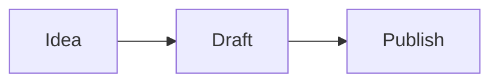

## What is Mermaid?

**Mermaid** is a text-based diagramming language. Instead of dragging boxes around, you write a description — and the diagram is drawn for you. Because the source is plain text, diagrams live in your Markdown file, work with version control and are easy to edit.

To draw one, start a fenced code block with the word `mermaid`:

````example title="Your first diagram"

````

Quilldown draws Mermaid diagrams live in the preview. The **Diagram** menu in the toolbar inserts a working template for each type below — pick one and edit the text.

## Flowchart

Flowcharts show steps and decisions. `LR` means left to right; use `TD` for top to bottom. `[text]` is a box, `{text}` is a decision and `-->` is an arrow (add a label with `-- label -->`).

```diagram flowchart
```

## Sequence diagram

Sequence diagrams show how people or systems talk to each other over time. `->>` is a solid message arrow and `-->>` is a dashed reply.

```diagram sequence
```

## Gantt chart

Gantt charts lay tasks out on a timeline. Tasks can be `done`, `active`, or follow another with `after`.

```diagram gantt
```

## Pie chart

A pie chart needs a title and labelled values.

```diagram pie
```

## Class diagram

Class diagrams show types, their members and how they relate. `<|--` means "inherits from".

```diagram class
```

## State diagram

State diagrams describe the states of something and what moves it between them. `[*]` marks the start and end.

```diagram state
```

## Entity-relationship diagram

ER diagrams show how data entities relate. The symbols before and after the line describe how many of each (`||` exactly one, `o{` zero or more, `|{` one or more).

```diagram er
```

## Mind map

Mind maps organise ideas radiating from a central topic, using indentation for each level.

```diagram mindmap
```

## Tips for clean diagrams

- **Keep labels short.** Long text makes boxes huge; move detail into the surrounding prose.
- **Quote labels with special characters:** `A["Costs (USD)"]`.
- **Add comments** with `%%` at the start of a line — they don't show in the diagram.
- **Pick the direction that fits your page.** `LR` suits wide layouts; `TD` suits portrait pages and PDFs.
- **Write the diagram description next to the diagram.** It helps readers who can't see the picture and helps search engines understand your page.

## Troubleshooting

| Symptom | Likely cause |
| --- | --- |
| "Diagram error" box instead of a drawing | A typo in the syntax. The message names the line — check spaces, arrows and missing keywords |
| Nothing draws | The code block isn't tagged `mermaid`, or the fence isn't closed |
| Text is cut off | Shorten the label or wrap it in quotes |
| Diagram looks dark in a light document | Quilldown redraws diagrams with a light theme for PDF, Word, PNG and EPUB exports |

## Diagrams in exports and other tools

- **PDF, Word, PNG and EPUB** exports embed your diagrams as images, drawn in a light theme.
- **HTML** exports contain the diagram as inline SVG.
- **GitHub and GitLab** also render `mermaid` code blocks natively, so the same Markdown works in your repository.

See the [Markdown cheat sheet](/guides/markdown-cheat-sheet) for everything else you can write, or learn how to add [equations with LaTeX](/guides/latex-math-in-markdown).

## Frequently asked questions

### How do I add a diagram to Markdown?

Add a fenced code block whose language is `mermaid` and write the diagram description inside. An editor that supports Mermaid, like Quilldown, draws it live.

### Which diagram types does Mermaid support?

Many, including flowcharts, sequence diagrams, Gantt charts, pie charts, class diagrams, state diagrams, entity-relationship diagrams and mind maps — all available as templates in Quilldown.

### Can I export Markdown diagrams to PDF or Word?

Yes. Quilldown embeds each diagram as an image when you export to [PDF](/guides/markdown-to-pdf), [Word](/guides/markdown-to-word), PNG or EPUB.

### Do diagrams work offline?

Yes. The diagram engine is bundled with Quilldown and loads only when a document contains a diagram, so it works without an internet connection.

### Why do I see "Diagram error"?

Mermaid couldn't parse the text. Check the syntax against the examples on this page — common causes are a missing arrow, an unclosed bracket or a typo in the diagram type.
