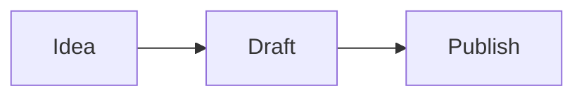
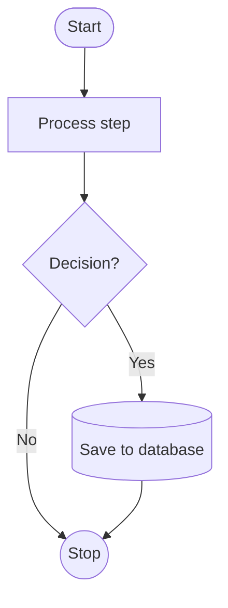
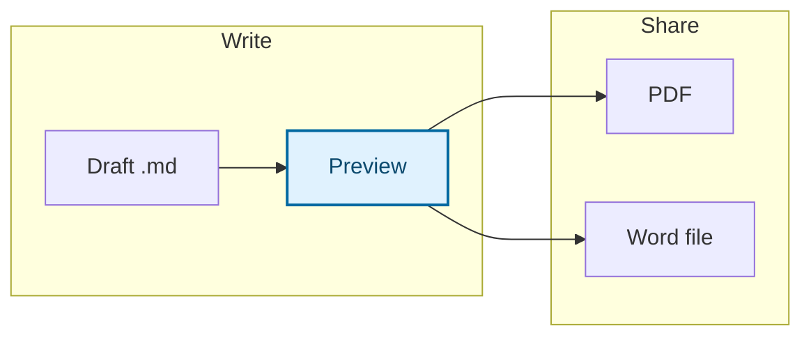
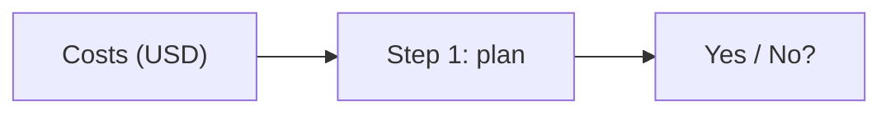
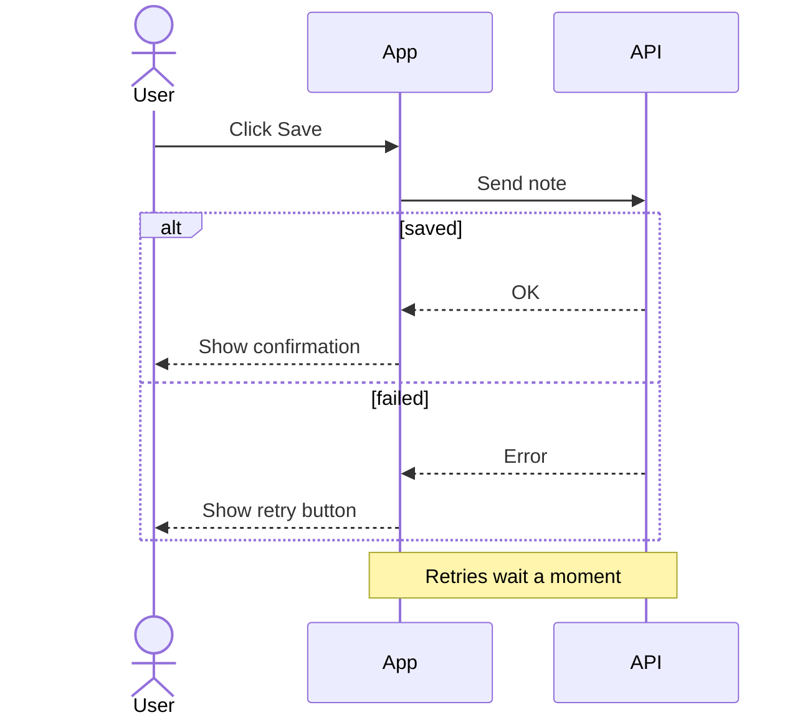
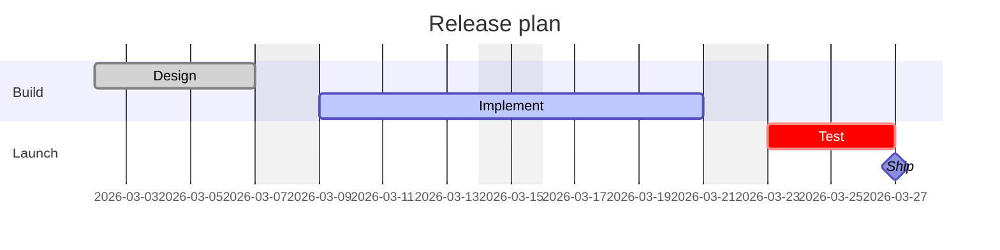
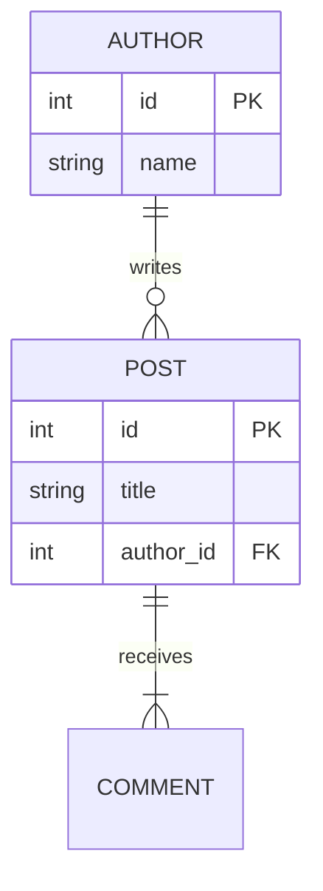

## How to draw a diagram in Markdown

**Start a fenced code block with the word `mermaid` and describe the diagram inside it.** Mermaid is a text-based diagramming language: you write the relationships, and the layout is worked out for you. Because the source is plain text, the diagram lives in your Markdown file, shows up cleanly in version-control diffs and is easy to edit later.

````example title="Your first diagram"

````

Quilldown draws Mermaid diagrams live in the preview and matches them to the light or dark theme. The toolbar has buttons for inserting diagrams, which is a quick way to get a working starting point. GitHub also renders `mermaid` blocks in Markdown files, so the same source works in a repository, for example in a [README](/guides/readme-template).

The first word inside the block declares the diagram type, and everything after it follows that type's own syntax. Get that first line right and most of the rest follows.

## When a diagram beats prose

A diagram earns its place when the reader would otherwise have to build the picture in their head.

- **Branching steps.** A process with decisions and loops is clearer as a flowchart than as nested bullets.
- **Conversations between parts.** Who calls whom, in what order, is the whole point of a sequence diagram.
- **Time and dependencies.** A schedule with tasks that wait on each other is a Gantt chart.
- **Structure.** Types, states and data relationships each have a diagram made for them.

Skip the diagram when a numbered list says the same thing, when you need exact figures (use a [table](/guides/markdown-table-generator)), or when the picture would need more than about a dozen boxes. Split big diagrams into two smaller ones rather than shrinking one.

## Which diagram type should you use?

| You want to show | Use | First line |
| --- | --- | --- |
| Steps, decisions, workflows | Flowchart | `flowchart TD` or `flowchart LR` |
| Messages between people or systems over time | Sequence diagram | `sequenceDiagram` |
| A schedule with durations and dependencies | Gantt chart | `gantt` |
| Types, fields, methods and inheritance | Class diagram | `classDiagram` |
| Lifecycle of one thing (draft, review, published) | State diagram | `stateDiagram-v2` |
| Tables in a database and how they relate | Entity-relationship diagram | `erDiagram` |
| Parts of a whole | Pie chart | `pie` |
| Ideas branching from one topic | Mind map | `mindmap` |

## Flowcharts

Flowcharts are the workhorse, so they get the most detail. After `flowchart`, give a direction:

| Direction | Flows | Suits |
| --- | --- | --- |
| `TD` (or `TB`) | Top to bottom | Portrait pages, long processes |
| `LR` | Left to right | Wide layouts, short pipelines |
| `BT` | Bottom to top | Hierarchies that grow upward |
| `RL` | Right to left | Rarely needed |

Each node has an id (`A`) and an optional label and shape. Arrows connect ids, and the text on an arrow goes between pipes:

```diagram flowchart
```

The shape is set by the brackets around the label:

| Syntax | Shape |
| --- | --- |
| `A[Text]` | Rectangle |
| `A(Text)` | Rounded rectangle |
| `A([Text])` | Stadium, often used for start and end |
| `A{Text}` | Diamond, for a decision |
| `A((Text))` | Circle |
| `A[(Text)]` | Cylinder, for a database |

Links come in a few styles: `-->` an arrow, `---` a plain line, `-.->` a dotted arrow and `==>` a thick arrow. This example uses several shapes and labelled branches:

````example title="Flowchart with shapes and labelled branches"

````

### Subgraphs and styling

Group related nodes with `subgraph … end`. Give a group of nodes a look with `classDef`, then attach it with `class`. Set the text colour as well as the fill so the diagram stays readable in both light and dark themes.

````example title="Subgraphs and a highlighted node"

````

Use styling sparingly. One highlighted node to mark the path that matters says more than a rainbow, and colour alone should never carry meaning that the labels don't.

## Labels and special characters

Most Mermaid errors come from characters that have a meaning in the syntax. Wrap the label in double quotes and it is safe:

````example title="Quoting labels"

````

Three more habits save time. Start a comment line with `%%`; it never appears in the drawing. Never use the lowercase word `end` as a label or id in a flowchart, because it closes a subgraph; write `End` or quote it. And keep ids short and labels descriptive, so arrows stay readable in the source.

## Sequence diagrams

Sequence diagrams draw participants as columns and messages as arrows going down the page in time order. Declare participants first to control their order, and use `as` to give one a friendlier name.

```diagram sequence
```

The arrow you choose says what kind of message it is:

| Arrow | Meaning |
| --- | --- |
| `->>` | Solid line with an arrowhead: a request or call |
| `-->>` | Dashed line with an arrowhead: a reply |
| `->` and `-->` | Solid or dashed line with no arrowhead |
| `-x` | Solid line ending in a cross: a lost or failed message |
| `-)` | Open arrow: an asynchronous message |

Blocks such as `alt … else … end`, `loop … end` and `opt … end` show branches and repetition, and `Note over A,B: text` adds an annotation.

````example title="Sequence diagram with a branch and a note"

````

## Gantt charts

A Gantt chart needs a `dateFormat`, one or more `section` lines and tasks in the form `Name :status, id, start, duration`. The status (`done`, `active`, `crit`, `milestone`) is optional. A start of `after a1` chains a task to another by id, which keeps the schedule correct when a date moves.

```diagram gantt
```

````example title="Gantt chart with weekends excluded and a milestone"

````

## Class, state and entity-relationship diagrams

**Class diagrams** list a class's members inside braces, with `+` for public and `-` for private. `<|--` means inherits from, `-->` is an association and `"1"` or `"*"` next to a class shows how many.

```diagram class
```

**State diagrams** describe the states of one thing and what moves it between them. `[*]` marks the start and the end, and the text after the colon labels the transition.

```diagram state
```

**Entity-relationship diagrams** show how data relates. The symbols around the line give how many of each side: `||` exactly one, `o|` zero or one, `|{` one or more, `o{` zero or more. Add attributes in braces with a type, a name and an optional `PK` or `FK`.

```diagram er
```

````example title="ER diagram with attributes"

````

## Pie charts and mind maps

A **pie chart** takes a title and quoted labels with positive numbers. Add `showData` after `pie` to print the values in the legend. Mermaid works out the percentages, so the numbers do not need to add up to 100.

```diagram pie
```

A **mind map** uses indentation for each level of the hierarchy. The first line under `mindmap` is the root, and wrapping it in double parentheses makes it a circle.

```diagram mindmap
```

## Keeping diagrams readable

- **Aim for about a dozen nodes.** Past that, split the diagram or move detail into text.
- **Keep labels to a few words.** A long label makes one box huge and distorts the whole layout.
- **Choose the direction for the page.** `LR` suits wide layouts; `TD` suits portrait pages and PDFs.
- **Name the arrows that matter.** Label decision branches (`Yes`, `No`) and leave the obvious ones bare.
- **Describe the diagram in the sentence above it.** It helps readers who skim, use screen readers or can't see the image.
- **Use consistent wording.** If one step says "Send" and the next says "Dispatch" for the same action, readers will look for a difference.

## Common errors and how to fix them

When Mermaid can't parse a diagram, the preview shows an error message that usually names the offending line. Match it against the table.

| Symptom | Likely cause | Fix |
| --- | --- | --- |
| Code is shown as text, no drawing | The fence isn't tagged `mermaid`, or it is never closed | Write ```` ```mermaid ```` and close with three backticks |
| A "Diagram error" box with a parse message | A typo in the type keyword, such as `flowchar`, or a missing arrow | Check the first line against the table above, then the line the message names |
| Error on a label with brackets | `A[Costs (USD)]` has parentheses inside brackets | Quote it: `A["Costs (USD)"]` |
| A subgraph or the whole chart breaks | A node or label named `end` in lowercase | Use `End` or `"end"` |
| Mind map nests wrongly | Inconsistent indentation | Indent every level with the same number of spaces |
| Gantt bars land in the wrong place | A date that doesn't match `dateFormat`, or an `after` that names an id that doesn't exist | Match dates to the format and check the ids |
| Pie chart fails | A label without quotes, or a non-numeric value | Write `"Label" : 40` |
| Boxes are huge or text overflows | Very long labels | Shorten the label and put the detail in the prose |

> [!TIP]
> Fix errors from the top. One early mistake, such as a missing keyword, can make every later line look wrong.

## Diagrams in exports and other tools

- **PDF.** Choose Export, then PDF. The browser's print dialog opens and you pick Save as PDF; diagrams appear as they do in the preview. The [Markdown to PDF guide](/guides/markdown-to-pdf) has page-setup tips.
- **Word (.docx).** Diagrams are exported as images, so they look right but can't be edited in Word. Keep the Mermaid source in your `.md` file. See [Markdown to Word](/guides/markdown-to-word).
- **GitHub.** `mermaid` blocks render in Markdown files, issues and pull requests, so the same source works there.
- **Other platforms.** Support varies, so check before you publish. When it is missing, the block appears as ordinary code.

For everything else you can put in a document, see the [Markdown cheat sheet](/guides/markdown-cheat-sheet). To add formulas beside your diagrams, read [how to write math in Markdown](/guides/latex-math-in-markdown).

## Frequently asked questions

### How do I add a diagram to Markdown?

Add a fenced code block whose language is `mermaid` and write the diagram description inside it, starting with the diagram type such as `flowchart TD`. An editor that supports Mermaid, like Quilldown, draws it live in the preview.

### Which diagram type should I choose?

Use a flowchart for steps and decisions, a sequence diagram for messages between systems over time, a Gantt chart for schedules, a class or ER diagram for structure, a state diagram for a lifecycle, a pie chart for parts of a whole and a mind map for brainstorming. The chooser table on this page lists the first line for each type.

### Can I export Markdown diagrams to PDF or Word?

Yes. In a [PDF export](/guides/markdown-to-pdf) the diagrams appear as they do in the preview, and a [Word export](/guides/markdown-to-word) contains them as images. The images can't be edited in Word, so keep the Mermaid source in your Markdown file.

### Do Mermaid diagrams work on GitHub?

Yes. GitHub renders `mermaid` code blocks in Markdown files, issues and pull requests, so a diagram you draft in Quilldown can be pasted into a repository unchanged. Other sites vary, and a platform without Mermaid support will show the block as plain code.

### Why do I see "Diagram error" instead of my diagram?

Mermaid couldn't parse the text. Common causes are a misspelled diagram type on the first line, parentheses inside an unquoted label, the lowercase word `end` used as a label, or inconsistent indentation in a mind map. Read the line number in the message and compare that line with the examples above.

### Do diagrams work offline?

Yes. Quilldown works offline after your first visit, so diagrams keep drawing without a connection.
